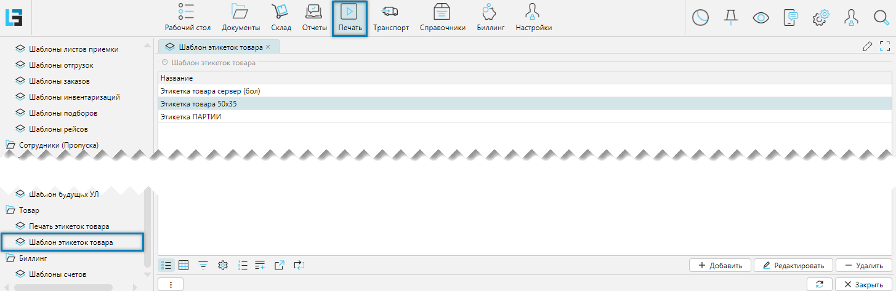
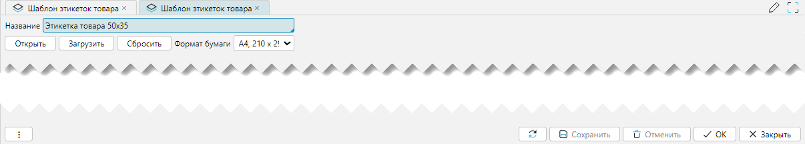

Измененные или новые шаблоны документов подключаются через меню **Печать-Шаблон < имя документа >**, который 
вызывает форму отображения со списком шаблонов. В целом большинство форм отображения и редактирования шаблонов 
работают одинаково, что говорит об универсальности подхода к использованию и редактированию шаблонов.

Рассмотрим на примере **Шаблон этикеток товара**.

## Форма отображения

 
_Рис. 1 Форма отображения_

## Добавление шаблона

 
_Рис. 2 Форма добавления шаблона_

Редактирование:
- **Название** - название шаблона под каким именем он будет доступен на форме [Шаблон печати](printdocs.md) для выбора
- **Открыть** - кнопка, которая выгружает существующий шаблон в папку Downloads с уникальным буквенно-цифровым 
  именем. Это действие может быть использовано, в том числе, для внесения исправлений в выгруженный шаблон с 
  последующей загрузкой его в систему после исправлений.  
- **Загрузить** - кнопка, которая открывает форму диалога открытия файлов. Далее необходимо найти файл нужного 
  шаблона и нажать на форме диалога кнопку **Открыть (Open)** для загрузки шаблона в базу данных системы.
- **Сбросить** - кнопка сбрасывает ранее загруженный шаблон.
- **Формат бумаги** - при нажатии вызывается справочник [форматов бумаги](printformats.md) для выбора нужного значения. 

## Редактирование шаблона
Шаблоны документов представляют собой файл формата XML с расширением JRXML. Создание и редактирование файла возможно в
бесплатном редакторе JasperSoft Studio. Выполнить небольшие исправления можно в обычном текстовом редакторе. 
