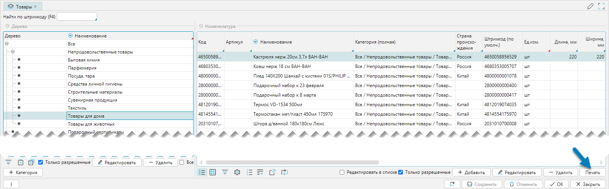
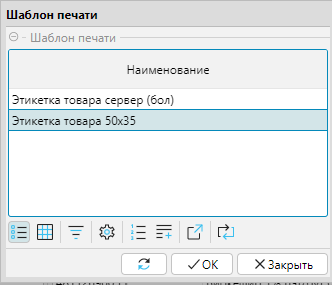
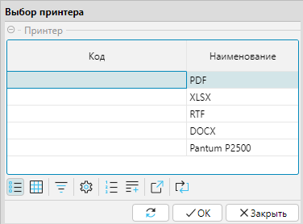

Общий подход при вызове печатных форм, выборе шаблонов печати и принтеров можно рассмотреть на примере печати этикетки
на товар, который включает:

- Наличие кнопки **Печать** на форме

   
  Рис. 1 Кнопка Печать на форме

- Выбор шаблона печати, если документов более одного, иначе этап будет пропущен

   
  Рис. 2 Форма выбора Шаблона печати

- Выбор принтера, куда будет направлен вывод, если их более одного, иначе этап будет пропущен

   
  Рис. 3 Форма выбора Принтера

