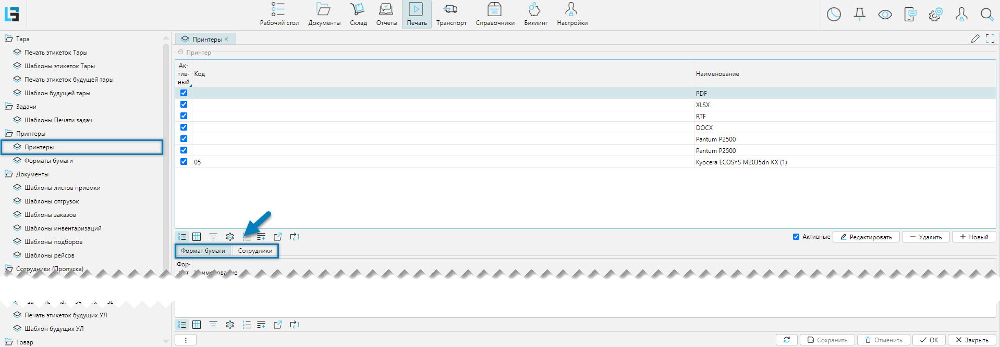
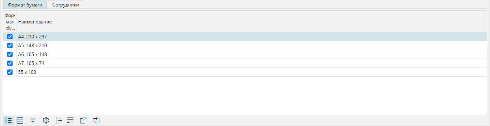
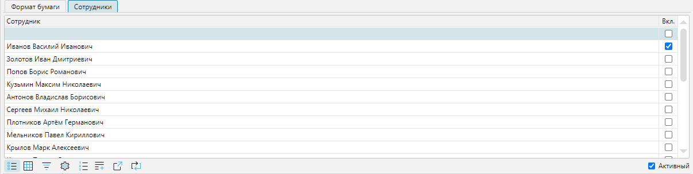
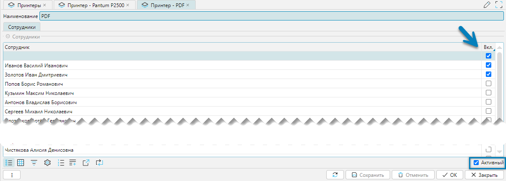
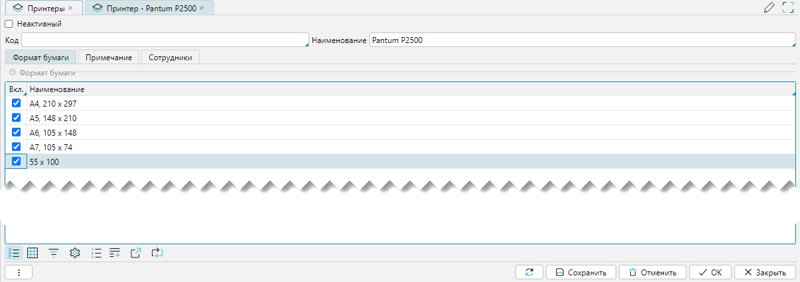

В системе можно настроить принтеры и связать их с сотрудниками системы. 
Настройка принтеров доступна из меню **Печать-Принтеры-Принтеры**.

## Отображение справочника

 
_Рис. 1 Форма отображения справочника_

- Форма состоит из верхней табличной формы **Принтер**, которая содержит:
    - список доступных для вывода в файл типов документов. По умолчанию присутствует 4 предопределенных типа, в 
      который может быть выгружен шаблон документа: PDF, XLSX, RTF, DOCX 
    - со списком физических принтеров. Имена принтеров записываются так, как они определены в операционной
      системе
    - **Активные** - фильтр, который установлен по умолчанию при открытии формы, для отображения активных (доступных) 
      принтеров
- Связанных нижних табличных форм в двух вкладках:
    - Вкладка **Формат бумаги**

       
      _Рис. 2 Вкладка Формат бумаги_
  
    - Вкладка **Сотрудники**, за которыми могут закреплены отдельные форматы документов и принтеры

       
      _Рис. 3 Вкладка Сотрудники_

      На форме присутствует фильтр **Активный**, который установлен по умолчанию при открытии формы, для отображения 
      действующих сотрудников. Если фильтр снять, то будут отображаться все сотрудники, которые когда-либо работали.

## Редактирование в справочнике
Редактирование в справочнике позволяет связать сотрудников с принтерами и форматами бумаги. При печати документов 
будут доступны шаблоны, у которых совпадают форматы бумаги принтера с форматами бумаги, закрепленные за шаблонами. Но 
редактирование имеет особенности, которые касаются выбранных типов принтеров:

- Если для редактирования выбран формат представления документа в PDF, XLSX, RTF, DOCX, то форма редактирования 
  выглядит так:

   
  _Рис. 4 Форма редактирования_

  Форма позволяет связать формат документа с сотрудником. Для закрепления принтера за сотрудниками необходимо 
  установить флажок в колонке **Вкл**. Если за сотрудником нет закрепленных принтеров, то принимается, что 
  сотруднику разрешены все принтеры. 
  **Активный** - это фильтр действующих сотрудников, который установлен по умолчанию при открытии формы.  Если 
  фильтр отменить, то будет отображаться полный список сотрудников, которые когда-либо работали. 

- Если для редактирования выбран физический принтер, то форма редактирования выглядит так:

   
  _Рис. 5 Форма редактирования_

  Редактирование:
  - **Неактивный** - если флажок установлен, то принтер становится неактивным.
  - **Код** - предназначен для уникальной идентификации принтера.
  - **Наименование** - имя принтера в операционной системе.
  - **Формат бумаги** - вкладка для связывания принтера с форматами бумаги.
  - **Примечание** - вкладка содержит текстовое поле для указания дополнительной информации.
  - **Сотрудники** - вкладка содержит список сотрудников для закрепления их за принтером  
    (_рассматривалось выше, см. рис. 4_).

