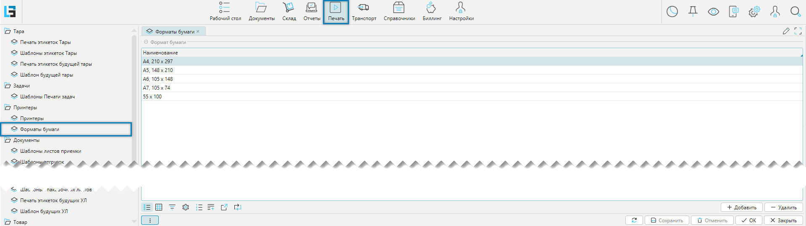

В системе можно задать разные форматы для документов. Настройка форматов доступна из меню **Печать-Принтеры-Форматы 
бумаги**. 

## Отображение справочника

 
_Рис. 1 Отображение справочника форматов бумаги_

<info>
**Важно**
- Вносимые значения связывают при печати документов форматы бумаги принтеров и шаблонов документов
- Для того чтобы шаблон документа мог быть распечатан, он должен быть привязан к своему формату бумаги
</info>

## Редактирование формата бумаги
Создание новых значений производится непосредственно в табличной части после нажатия на кнопку **Добавить**
(Рис. 1). После нажатия на кнопку добавится пустая запись, для которой в колонке **Наименование** необходимо внести
требуемое значение. Для редактирования уже созданной записи достаточно перейти в табличной части на нужную запись и
кликнуть по ней мышью и строка станет доступной для редактирования. После завершения редактирования табличной 
необходимо нажать на кнопку **Сохранить**, чтобы сохранить внесенные изменения.
