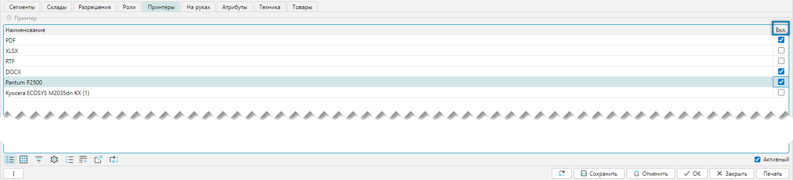

Справочник предназначен для учета сотрудников, статистики посещений и назначения прав на выполнение операций.

Справочник сотрудники доступен из меню **Справочники-Сотрудники-Сотрудники** (Рис. 1) или **Рабочий стол-Справочники-Сотрудники**. 
Справочник может как импортироваться из внешней системы, так и создаваться и редактироваться в lsFusion WMS.

## Отображение справочника

 
Рис. 1 Отображение справочника Сотрудники

Кнопка "Печать" (Рис. 1(1)) предназначена для печати пропусков.  
При этом если шаблон один, то печать производится сразу, если шаблонов несколько, то отобразится окно выбора для поиска нужного шаблона. 

 
Рис. 2 Выбор пропусков для печати

 
Рис. 3 Пример печатной формы: Пропуск для сотрудника 

<tip>
**Печать пропусков**
- Из меню **Справочники-Сотрудники-Сотрудник**
- Из меню **Рабочий стол-Справочники-Сотрудники**
- Из меню **Печать-Сотрудники (Пропуска)-Печать пропусков** 
</tip>

## Редактирование справочника

 
Рис. 4 Форма редактирования справочника Сотрудники

Форма редактирования может быть условно разделена на три функциональных блока:
1. Логин - группа параметров, отвечающих за вход в систему
2. Информация - информация о сотруднике и параметры, определяющие его возможности
3. Вкладки - параметры, определяющие возможности сотрудника по отдельным направлениям работы

### Логин
- **Штрихкод** - создается автоматически для каждого нового сотрудника, значение не редактируется
- **Логин** - это имя пользователя, которое используется для входа в систему
- **Пароль** - секретная комбинация символов, используемая для входа в систему
- **Заблокирован** - флажок, который блокирует пользователя для входа в систему

### Информация
- **Фамилия** - фамилия сотрудника
- **Имя** - имя сотрудника
- **Отчество** - отчество сотрудника
- **День рождения** - дата рождения
- **Должность** - занимая должность
- **E-mail** - адрес электронной почты
- **Телефон** - телефон или телефоны
- **Разрешить корректировку исполнения задач** - в процессе исполнения задач может возникнуть ситуация с ошибочным определением 
количества перемещаемых единиц хранения при закрытии задачи сотрудником. Флаг разрешает корректировку графы фактическое количество. 

[//]: # (todo "Разрешить корректировку исполнения задач", дать ссылку на задачи с описанием механизма назначения задач)
- **Уведомление об остановке автоназначения** - в системе работает механизм автоматического назначения задач, который отрабатывает с заданной периодичностью. 
Если цикл автоназначения прервался (нештатная ситуация), то сотруднику будет отправлено сообщение на e-mail для принятия решений, если флаг установлен.     
- **Разрешить корректировку серийных номеров** - разрешает отменять результат сканирования ошибочно введенного серийного номера.

### Вкладка Сегменты
Вкладка отвечает за назначение за сотрудником мест хранения

 
Рис. 5 Вкладка Сегменты

Форма представляет собой древовидный интерфейс (Рис. 5(1)) со списком складов и их структур. 
На любом уровне сотруднику может быть представлен доступ в качестве оператора и(или) кладовщика (Рис. 5(2)). 
***

### Вкладка Склады
Вкладка устанавливает ограничения и разрешения на доступ к складам

 
Рис. 6 Вкладка Склады

- **Ограничить доступ** - если флажок установлен, то он ограничивает доступ ко всем складам
- **Колонка Разрешить** - устанавливает для сотрудника отдельные разрешения для отдельных складов

Если имеются ограничения для сотрудника на склад или группу складов: 
- то они не будут отражаться для сотрудника в соответсвующий формах
- если сотрудник кладовщик, то задачи по таким складам будут исключаться из автоназначения 
***

### Вкладка Роли
Вкладка определяет роль сотрудника в системе.

 
Рис. 7 Вкладка Роли

В системе могут быть предусмотрены разные роли. 
Например, роль кладовщика, или роль члена инвентаризационной комиссии, и так далее.  
Создание ролей и назначение прав регулируется меню **Администрирование-Политика безопасности**.  
Отдельно можно добавить, что каждая роль может видеть только доступные ей формы и выполнять назначенные действия, что будет определяться ее правами.  
Стоит различать права пользователей и сотрудников, например: 
- если сотруднику назначена роль администратор, то он может выполнять действия свойственные администратору и кладовщику (работать с товаром) 
- если зарегистрированный в системе пользователь администратор, то он не может выполнять действия, связанные с товаром, за который он не несет ответственности. 

[//]: # (todo - дать ссылку на администрирование, В администрировании расписать роли, запрещения, разрешения в соответствии с медиа файлом Сотрудники_Склады.mp4, 0:30:18)
***

### Вкладка Принтеры
Вкладка определяет возможные типы документы, в формате которых будет сформирован документ для печати.

 
Рис. 8 Вкладка Принтеры

В настоящее время в системе присутствуют 4 типа документов, в которых может быть сформирована печатная форма:
- PDF - самый быстрый тип формируемого документа
- XLSX - документ будет сформирован как Excel документ с уникальным именем и может быть открыт через приложение Excel или его аналог
- RTF - документ будет сформирован как RTF документ с уникальным именем и может быть открыт через приложение MS Word или его аналог
- DOCX - документ будет сформирован как DOCX документ с уникальным именем и может быть открыт через приложение MS Word или его аналог

Наличие нескольких типов документов может смутить, на самом деле это удобно и зависит от конкретно решаемой задачи. 
В формате PDF документ готов к печати и не требует сторонних приложений, с другой стороны, 
если предполагается отдельная запись документов на диск, отправка по E-mail заказчику, дальнейшая работа с документом и т.д., 
то альтернативой станут типы документов XLSX, RTF, DOCX. 
Если не отмечен ни один формат или отмечено 2 и более форматов перед печатью выбранного документа всегда вызывается форма выбора принтера, 
под которым понимается в какой тип документа будет выгружена информация.  
***

### Вкладка На руках
Вкладка отражает находящиеся у сотрудника единицы хранения в момент их перемещения из точки "Откуда" в точку "Куда", 
то есть это то, что сотрудник взял, но еще не положил. Когда процесс перемещения завершится сотрудник на ТСД проставит перемещенное количество единиц хранения.

 
Рис. 9 Вкладка На руках

Форма состоит табличной части из номенклатуры (Рис. 9(1)) и связанного с номенклатурой движения единиц хранения (Рис. 9(2)). 

[//]: # (todo - флажок активный, что означает)
***

### Вкладка Атрибуты
Вкладка содержит дополнительные атрибутыЮ которые могут быть присвоены сотруднику.

 
Рис. 10 Вкладка Атрибуты

Атрибут - это дополнительная характеристика, расширяющая описание редактируемого объекта, в данном контексте - справочника Сотрудников.
Настройка атрибутов выполняется в разделе [Настройки - Атрибуты](attributes.md).
***

### Вкладка Разрешения
Вкладка устанавливает для сотрудника особые разрешения для каждого вида задач

 
Рис. 11 Вкладка Атрибуты

Для назначения задачи выбранному сотруднику необходимо установить флажок в колонке 'Вкл.' в табличной части формы (Рис. 11(1)).

<tip>
**Примечание**
- Вкладка Разрешения зависит от состава подключенных модулей, поэтому для разных объектов содержание вкладки по видам
  задач будет разным
</tip>
***

### Вкладка Техника
Вкладка закрепляет за сотрудником технику

 
Рис. 12 Вкладка Техника

В табличной части отражается наименование и тип техники (Рис. 12(2)) и период времени ее эксплуатации (Рис. 12(3)).

Для добавления новой единицы техники надо стать на поле **Техника** (Рис. 12(1)) и из списка выбрать нужную технику.

 
Рис. 13 Справочник техники

При выборе новой техники, если за сотрудником была закреплена какая-то другая техника, 
то время окончания ее эксплуатации (колонка **по**) заполнится автоматически.

Для завершения работы с техникой в текущем списке формы (Рис. 12) необходимо стать на закрываемое оборудование, затем 
на поле **Техника** (Рис. 12(1)) и вызвать список техники (Рис. 13) и нажать на кнопку **Сбросить**.

<tip>
**Примечание**
- вкладка доступна, если подключен модуль Техника склада
</tip>
***

### Вкладка Товары
Вкладка разрешает или ограничивает доступ сотрудника для работы с определенными товарами

 
Рис. 14 Вкладка товары

1. **Ограничить доступ** - если установлено (Рис. 14(1)), то доступ ко всем товарам будет ограничен, 
при этом если ранее были установлены галки на категориях товара, то они автоматически снимутся
2. **Колонка Вкл.** - разрешает категорию товаров

