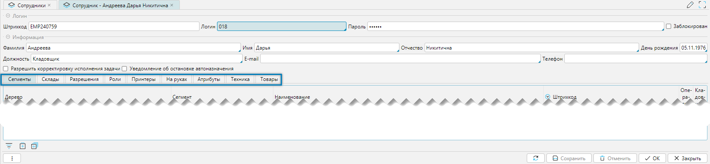

Справочник предназначен для учета сотрудников, хранения информации и назначения прав на выполнение операций.

Справочник можно импортировать из внешней системы или создать и редактировать в lsFusion WMS.

## Отображение справочника

Справочник сотрудников доступен из меню **Справочники-Сотрудники-Сотрудники** (рис. 1) или **Рабочий
стол-Справочники-Сотрудники**.

 
*Рис. 1 Отображение справочника Сотрудники*

- Колонка **Задача** отображает активность сотрудников и назначенные им задачи. Для активных сотрудников,
  работающих с ТСД, фон строки подсвечен зелёным цветом. Если задача назначена, колонка содержит название операции, её
  код, дату и время.
- Кнопка **Печать** предназначена для печати пропусков. При этом если шаблон один, то печать производится сразу, если
  шаблонов несколько, то отобразится окно выбора для поиска
  нужного шаблона.

 
_Рис. 2 Выбор пропусков для печати_

 
Рис. 3 Пример печатной формы: Пропуск для сотрудника 

<tip>
**Печать пропусков**
- Из меню **Справочники-Сотрудники-Сотрудник**
- Из меню **Рабочий стол-Справочники-Сотрудники**
- Из меню **Печать-Сотрудники (Пропуска)-Печать пропусков** 
</tip>

## Редактирование сотрудника

 
Рис. 4 Форма редактирования справочника Сотрудники

Форма редактирования может быть условно разделена на три функциональных блока:
1. Логин - группа параметров, отвечающих за вход в систему
2. Информация - общая информация о сотруднике
3. Вкладки - параметры, определяющие возможности сотрудника по отдельным направлениям работы

### Логин
- **Штрихкод** - создается автоматически для каждого нового сотрудника, значение не редактируется
- **Логин** - это имя пользователя, которое используется для входа в систему
- **Пароль** - секретная комбинация символов, используемая для входа в систему
- **Заблокирован** - флажок, который блокирует пользователя для входа в систему

### Информация
- **Фамилия** - фамилия сотрудника
- **Имя** - имя сотрудника
- **Отчество** - отчество сотрудника
- **День рождения** - дата рождения
- **Должность** - занимая должность
- **E-mail** - адрес электронной почты
- **Телефон** - телефон или телефоны
- **Разрешить корректировку исполнения задач** - в процессе исполнения задач может возникнуть ситуация с ошибочным
  определением количества перемещаемых единиц хранения при закрытии задачи сотрудником. Флаг разрешает корректировку 
  графы фактическое количество.

[//]: # (todo "Разрешить корректировку исполнения задач", дать ссылку на задачи с описанием механизма назначения задач)

- **Уведомление об остановке автоназначения** - в системе работает механизм автоматического назначения задач, который
  отрабатывает с заданной периодичностью. Если цикл автоназначения прервался (нештатная ситуация), то сотруднику 
  будет отправлено сообщение на e-mail для принятия решений, если флаг установлен.
- **Разрешить корректировку серийных номеров** - разрешает отменять результат сканирования ошибочно введенного серийного
  номера.

### Вкладка Сегменты
Вкладка отвечает за назначение за сотрудником мест хранения

 
Рис. 5 Вкладка Сегменты

Форма представляет собой древовидный интерфейс со списком складов и их структур. 
На любом уровне сотруднику может быть представлен доступ в качестве [кладовщика](../intro/terminology.md#люди), за что 
отвечает наличие флажка в колонке **Кладовщик**
***

### Вкладка Склады
Вкладка устанавливает ограничения и разрешения на доступ к складам

 
Рис. 6 Вкладка Склады

- **Ограничить доступ** - если флажок установлен, то он ограничивает доступ ко всем складам
- **Колонка Разрешить** - устанавливает для сотрудника отдельные разрешения для отдельных складов

Если имеются ограничения для сотрудника на склад или группу складов: 
- то они не будут отражаться для сотрудника в соответсвующий формах
- если сотрудник кладовщик, то задачи по таким складам будут исключаться из автоназначения 
***

### Вкладка Роли
Вкладка определяет роль сотрудника в системе.

 
Рис. 7 Вкладка Роли

В системе предусмотрено создание ролей, которые назначаются группам пользователей. Это позволяет централизованно
управлять правами доступа и действиями для пользователей. Создание ролей и назначение их прав осуществляется через меню 
**Администрирование-Система-Доступ-Политика безопасности.** 
Вкладка **Роли** позволяет оперативно расширять полномочия сотрудников, добавляя им новые роли. Для добавления новой 
роли необходимо установить флажок в колонке **Вкл.**.

[//]: # (todo - дать ссылку на администрирование, В администрировании расписать роли, запрещения, разрешения в соответствии с медиа файлом Сотрудники_Склады.mp4, 0:30:18)
***

### Вкладка Принтеры
Вкладка позволяет закрепить принтеры за сотрудником.

 
Рис. 8 Вкладка Принтеры

Вывод печатной формы может направлен:

- в файл, определенного типа: PDF, XLSX, RTF, DOCX. В дальнейшем сформированный файл может быть открыт ассоциированной
  программой, и далее, например, отредактирован, распечатан, преобразован в другой формат, сохранен на какой-либо 
  носитель или отправлен на e-mail, если перечисленные действия доступны из программы
- на физический принтер

Если за сотрудником не назначен ни один принтер или назначено 2 и более, то перед печатью выбранного документа всегда 
вызывается форма выбора принтера. 
Флажок фильтра **Активный** отображает только активные принтеры в системе. Список принтеров задается в системе 
в разделе меню [**Печать-Принтеры-Принтеры**](../wmsprint/printerwms.md)
***

### Вкладка На руках

Вкладка отражает находящиеся у сотрудника единицы хранения в момент их перемещения из точки "Откуда" в точку "Куда",
то есть это то, что сотрудник взял, но еще не положил. Когда процесс перемещения завершится сотрудник на ТСД проставит
перемещенное количество единиц хранения.

 
Рис. 9 Вкладка На руках

Форма состоит из 2-х табличных частей: номенклатура (верхняя таблица) и связанного с номенклатурой движения единиц 
хранения (нижняя таблица). 

[//]: # (todo - флажок активный, что означает, поменять картинку)
***

### Вкладка Атрибуты
Вкладка содержит дополнительные атрибуты, которые могут быть присвоены сотруднику.

 
Рис. 10 Вкладка Атрибуты

Атрибут - это дополнительная характеристика, добавляемая самостоятельно и расширяющая описание редактируемого 
объекта. На приводимом рисунке, можно заполнить: 
- **Примечание** - дополнительная информация о сотруднике

Настройка атрибутов выполняется в разделе [Настройки - Атрибуты](../wmssettings/attributes.md).
***

### Вкладка Разрешения
Вкладка устанавливает для сотрудника особые разрешения для каждого вида задач

 
Рис. 11 Вкладка Разрешения

Для назначения задачи выбранному сотруднику необходимо установить флажок в колонке 'Вкл.' в табличной части формы.

<tip>
**Примечание**
- Вкладка Разрешения зависит от состава подключенных модулей, поэтому для разных объектов содержание вкладки по видам
  задач будет разным
</tip>
***

- **Интерфейс ТСД в браузере** - при установленном флаге разрешает отображать
  [интерфейс ТСД](../additional/pdtemulator.md) в браузере.

### Вкладка Техника
Вкладка закрепляет за сотрудником временно технику

 
Рис. 12 Вкладка Техника

В табличной части отражается наименование и тип техники и период времени ее эксплуатации (колонки **с** и **по**).

**Для добавления** новой единицы техники необходимо установить курсор на поле **Техника**, кликнуть по нему, и в
появившемся списке выбрать нужную единицу. Выбор подтверждается нажатием кнопки **Ок** на форме списка.

 
Рис. 13 Список Техника

После добавления техника будет отображена в табличной части вкладки **Техника**, а в колонке **с** автоматически
зафиксируется время начала её эксплуатации. Если на момент выбора за сотрудником уже была закреплена какая-то другая 
техника, то она открепляется автоматически. При этом в колонке **по** фиксируется время окончания её использования.

**Для завершения** работы с последней выбранной техникой необходимо установить курсор на поле **Техника**, кликнуть по
нему, и в появившемся списке (_ничего не выбирая_) нажать кнопку **Сбросить**. 

<tip>
**Примечание**
- вкладка доступна, если подключен модуль Техника склада
</tip>
***

### Вкладка Товары
Вкладка разрешает или ограничивает доступ сотрудника для работы с определенными товарами

 
Рис. 14 Вкладка товары

- **Ограничить доступ** - установка флага отменяет все ранее установленные разрешения. При этом предполагается, что 
  можно задать новые разрешения.
- **Колонка Вкл.** - в табличной части разрешает категорию товаров

