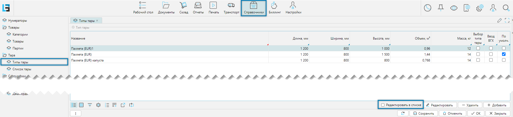
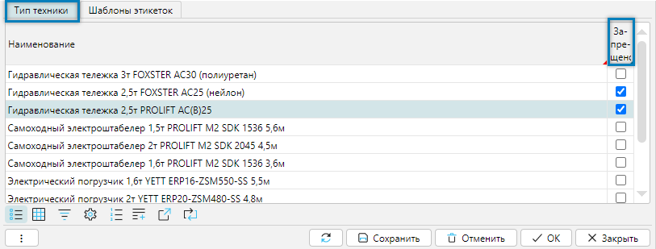
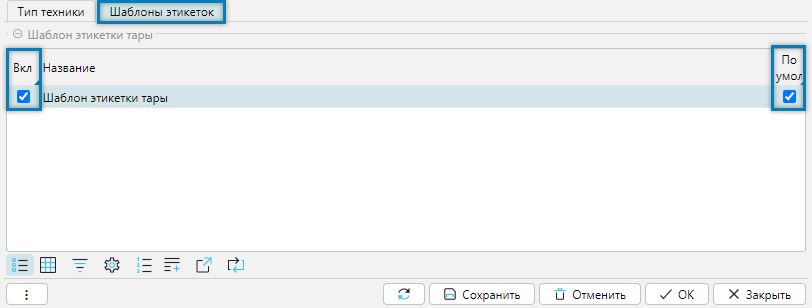
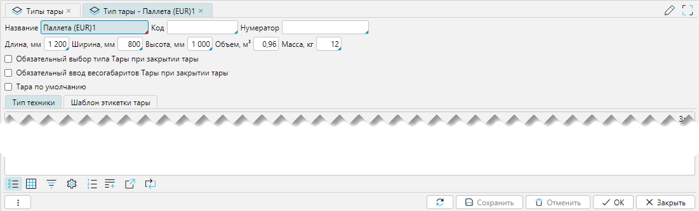

Одним из видов транспортных единиц является тара, к которой относятся поддоны, паллеты, контейнеры, ёмкости и другие 
объекты, предназначенные для хранения и транспортировки. Одной из характеристик тары является её тип, который 
определяется в системе через справочник **Типы тары**. 

Справочник доступен из меню **Справочники-Тара-Типы тары** (Рис. 1).

## Отображение справочника

 
_Рис. 1 Форма отображения справочника_

Флажок **редактировать в списке** включает/отключает отображение нижнего грида с группой вкладок:
- Тип техники
- Шаблон этикетки

### Вкладка Тип техники
Вкладка отвечает за установку запрета на использование техники при работе с текущей тарой.

 
_Рис. 2 Вкладка Тип техники_

Для запрета работы текущей тары с техникой необходимо непосредственно в табличной части проставить флажки в колонке
**Запрещено**.

### Вкладка Шаблон этикетки
Вкладка отвечает за закрепления шаблонов этикеток за текущей тарой

 
_Рис. 3 Вкладка Шаблон этикеток_

Для закрепления шаблона этикетки за тарой необходимо непосредственно в грид проставить флажки в колонке **Вкл**, а
также определить шаблон по умолчанию - колонка **По умолч.**

[//]: # (todo - Разобраться с печатью: не печатается штрих код на этикетке)
[//]: # (todo - Добавить два шаблона для примера, Добавить ссылки на печать откуда)

## Редактирование типа тары

 
_Рис. 4 Форма редактирования тары_

Форма редактирования справочника может быть поделена на несколько функциональных блоков:
- Характеристики тары
- Вкладка Тип техники
- Шаблон этикетки

### Характеристики тары

Редактирование характеристик:
- **Название** - название тары
- **Код** - необязательно, уникальный код однозначно идентифицирующий тип тары, например для задач импорта или экспорта
  данных.
- **Нумератор** - выбор [нумератора](../../wmssettings/defaultnumerators.md) для создания уникальной нумерации вносимых в систему тар.
  Для разных тар могут быть свои нумераторы или один общий, тогда все тары с одинаковым нумератором будут иметь
  общую сквозную нумерацию.
- **Длина**, **Ширина**, **Высота** - необязательно, габаритные характеристики в миллиметрах условной коробки - тары
  с товаром. Если задается высота, то она должна быть несколько ниже высоты ячейки, чтобы тара с товаром
  беспрепятственно входила или изымалась из ячейки. Габариты используются для расчёта возможности размещения товара
  на таре и тары с товаром в ячейке. Если габаритные размеры не заданы, то такой расчет не производится.
- **Объем, м3** - только для чтения, если заданы габаритные характеристики, то объем высчитывается автоматически.
- **Масса, кг** - вес пустой тары. Значение необходимо для расчета полной нагрузки тары с товаром на стеллаж.
- **Обязательный выбор типа Тары при закрытии тары** — если флажок установлен, то при закрытии новой тары,
  зарегистрированной по штрихкодам из журнала [Печать этикеток будущей тары](printfuturecontainers.md), 
  будет вызываться диалог выбора типа тары. Тип тары, указанный в поле **Тара по умолчанию** из 
  [настроек логики](../../wmssettings/options.md#вкладка-основные), автоматически присваивается таким штрихкодам при их регистрации.
  Диалог будет вызван только в случае совпадения текущего типа тары с этим значением. Для ранее зарегистрированных тар
  повторный выбор типа не требуется.
- **Обязательный ввод весогабаритов Тары при закрытии тары** - если установлено, то при закрытии тары будет запрос на
  ввод весогабаритных характеристик тары, которые перезапишут существующие характеристики.
- **Тара по умолчанию** - устанавливает тару по умолчанию и меняет значение поля **Тара по умолчанию** в
  [настройках логики](../../wmssettings/options.md#вкладка-основные)
***

### Вкладка Тип техники

Вкладка отвечает за установку запрета на использование техники при работе с редактируемой тарой. 
Все действия аналогичны [вкладка Тип техники](containertypes.md#вкладка-тип-техники) формы отображения справочника.
***

### Вкладка Шаблон этикетки

Вкладка отвечает за закрепления шаблонов этикеток за редактируемой тарой. 
Все действия аналогичны [вкладка Шаблон этикетки](containertypes.md#вкладка-шаблон-этикетки) формы отображения
справочника. 

