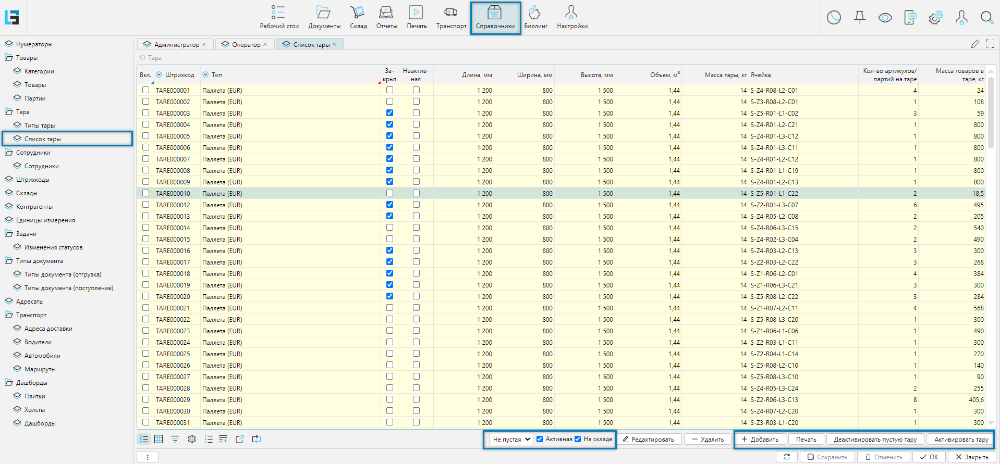
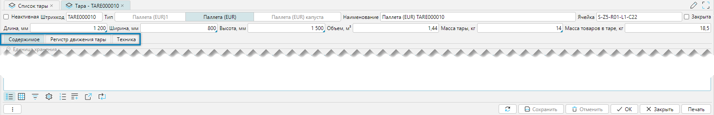
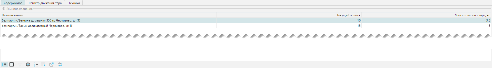
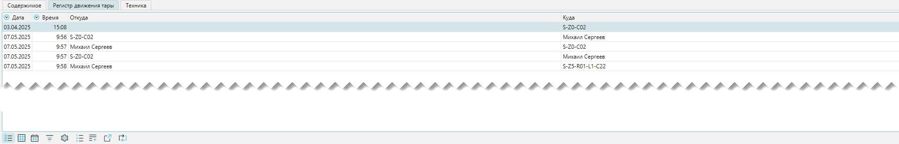
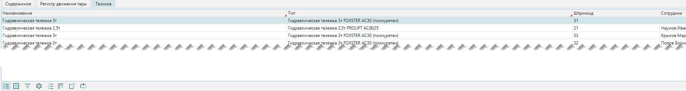

Список тары показывает все зарегистрированные в системе тары. Список доступен из меню **Справочники-Тара-Список
тары** (Рис. 1)

## Отображение списка тары

 
_Рис. 1 Форма отображения Список тары_ 

Дополнительно на форме присутствуют (слева-направо):

- Фильтры:
  - Фильтр по таре для фильтрации заполненности тары, который может принимать значения - Все, Не пустая, Пустая.
  - Фильтр **Активная** - по умолчанию включен, фильтр активной используемой тары. Тара может быть не активной для 
    использования, например: требует маркировки, требует ремонта, убыла с товаром со склада и т.д.
  - Фильтр **На складе** - по умолчанию включен, отражает тару, которая находится в настоящий момент на складе.
  
- Действия на форме:
  - Кнопка **Добавить** - вызывает создание заданного количества тар выбранного типа:
    
     
    _Рис. 2 Форма создания тар_
  
    В примере (Рис. 2) будет создано 10 новых тар с типом _Палета (EUR)_. Все характеристики, создаваемых тар, будут 
    взяты относительно справочника [типов тары](containertypes.md). После создания тар, в случае необходимости, каждую 
    тару можно будет отредактировать в индивидуальном порядке. 

  - Кнопка **Печать** - вызывает печать этикеток на тару. Если необходимо отпечатать несколько этикеток, то необходимо
    отметить нужное количество в колонке **Вкл.**
  - Кнопка **Деактивировать пустую тару** - операция используется, когда существует необходимость вывести из 
    обращения некоторое количество тар, например на замену, на маркировку, на убытие и т.д., для того чтобы
    исключить их использование. Для выполнения операции необходимо отметить планируемые к деактивации тары
    (колонка **Вкл.**) и нажать на кнопку. Алгоритм проверит не занятые тары и изменит их состояние, при этом 
    состояние для занятых тар не изменится.    
  - Кнопка **Активировать тару** - вводит в обращение неактивную тару. Для выполнения необходимо отметить группу тар,
    для которых выполняется операция.   
  

## Редактирование тары

 
_Рис. 3 Форма редактирования тары_

Форма редактирования быть условно разделена на две части:
- Общие свойства тары
- Вкладки - дополнительная информация о таре

Общие свойства тары:
- **Неактивная** - флажок, управляющий активностью тары. Если установлено, то тара не участвует в операциях 
  планирования 
- **Штрихкод** - штрихкод тары
- **Тип** - [тип тары](containertypes.md)
- **Наименование** - наименование тары. Формируется автоматически и состоит из типа тары и ее штрихкода
- **Ячейка** - наименование ячейки, где в настоящий момент находится тара
- **Закрыта** - если флаг установлен, то приемка в тару запрещена.
- **Длинна, Ширины, Высота, мм** - габаритные характеристики текущей тары. При этом габариты текущей тары могут 
  отличаться от габаритов, определенных в справочнике [типов тары](containertypes.md)  
- **Объем**, м3 - объем рассчитывается автоматически, исходя из заполненности габаритных характеристик
- **Масса тары**, кг - конкретная масса самой тары, значение которой берется из справочника типов тары, но при 
  необходимости может быть изменено, так же как и габаритные характеристики
- **Масса товаров в таре**, кг - значение массы товаров в таре рассчитывается автоматически. На конечный (_правильный_) 
  результат расчета влияет сумма всех товаров, хранящихся в таре, для которых заполнены 
  [весовые характеристики](../items.md#весогабаритные-характеристики)

### Вкладка Содержимое
Вкладка отражает товары, хранящиеся в таре

 
_Рис. 3 Вкладка содержимое_

Колонки табличной части:
- **Наименование** - наименование хранящегося в таре товара
- **Текущий остаток** - колонка отражает количество товара в текущей таре
- **Масса товаров в таре, кг** - вес каждого наименования товара в таре, при условии, что на товар заполнены весовые 
  характеристики.     
***

### Вкладка Регистр движения тары
Вкладка отражает движения тары 

 
_Рис. 4 Вкладка регистр движения тары_

Колонки табличной части:
- **Дата** - дата события по движению тары
- **Время** - время события по движению тары
- **Откуда** - ячейка или человек от которых начато движение тары
- **Куда** - ячейка или человек, как конечна точка прибытия тары
***

### Вкладка Техника
Вкладка отражает технику, которая может быть использована для работы с тарой 

 
_Рис. 5 Вкладка техника_

Колонки табличной части:
- **Наименование** - наименование техники
- **Тип** - тип техники
- **Штрихкод** - штрихкод техники
- **Сотрудник** - сотрудник, закрепленный за техникой

