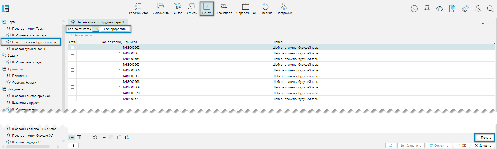

Журнал отвечает за создание маркировки для новой тары, отсутствующей в системе.

Журнал доступен из меню **Печать-Тара-Печать этикеток будущей тары** (Рис. 1)

## Логика работы

 
_Рис. 1 Форма создания этикеток будущей тары_

Общую логику, связанную этикетками будущей тары, можно представить в несколько этапов:
- В рамках подготовки к приёмке товара оператор формирует и распечатывает некоторое количество этикеток, 
  ориентируясь на производственную необходимость. После печати этикетки передаются кладовщикам для последующего 
  использования. На данном этапе штрихкоды, содержащиеся в этикетках, считаются неактивными и в системе отсутствуют. 
- В процессе приёмки кладовщик сканирует очередной штрихкод, маркирует им тару и размещает в неё поступающий товар. С
  момента сканирования штрихкод активируется, и тара регистрируется в системе с типом тары, указанным в 
  [настройках логики](../options.md#вкладка-основные) **Тара по умолчанию**. 
- При закрытии процесса приемки в тару, если для [типа тары](containertypes.md), совпадающего с типом тары в 
  настройках логики будет установлен флаг **Обязательный выбор типа Тары при закрытии тары**, то будет вызван диалог 
  для переопределения типа тары   

Для создания этикеток необходимо указать требуемое количество в поле «Количество этикеток», после чего нажать кнопку
«Сгенерировать», расположенную в верхней части формы (см. Рис. 1). На рисунке для примера отображены десять
сгенерированных штрихкодов. После создания штрихкодов необходимо отметить групповой корректировкой по колонке 
**Отм.** распечатываемые этикетки и нажать на кнопку **Печать** слева внизу формы. При необходимости можно также 
распечатать отдельную этикетку или этикетки. 