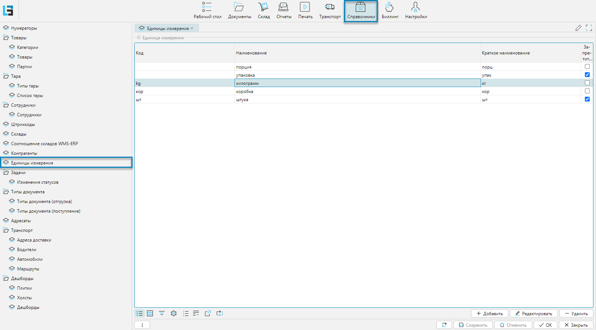

Справочник содержит данные о единицах измерения, которые применяются для учета, хранения и перемещения товаров.

Справочник можно импортировать из внешней системы или создать и редактировать в lsFusion WMS.

## Отображение справочника
Справочник отображается на форме **Справочники-Единицы измерения** (рис. 1).

 
_Рис. 1 Форма отображения справочника_

## Редактирование единицы измерения

Для каждой единицы измерения указывают:
- **Код** - идентификатор единицы измерения в системе
- **Наименование** - принятое название единицы измерения
- **Краткое наименование** - сокращенное обозначение единицы измерения, которое отображается на формах (документах,
отчетах и т.д.)
- **Запретить дробные** - если флажок установлен, то системе запрещено планировать подбор дробными количествами. 
Например, если идет подбор в штуках, то запрет дробных не позволит запланировать подбор на 0,4 штуки.

 
_Рис. 2 Форма редактирования единицы измерения_

