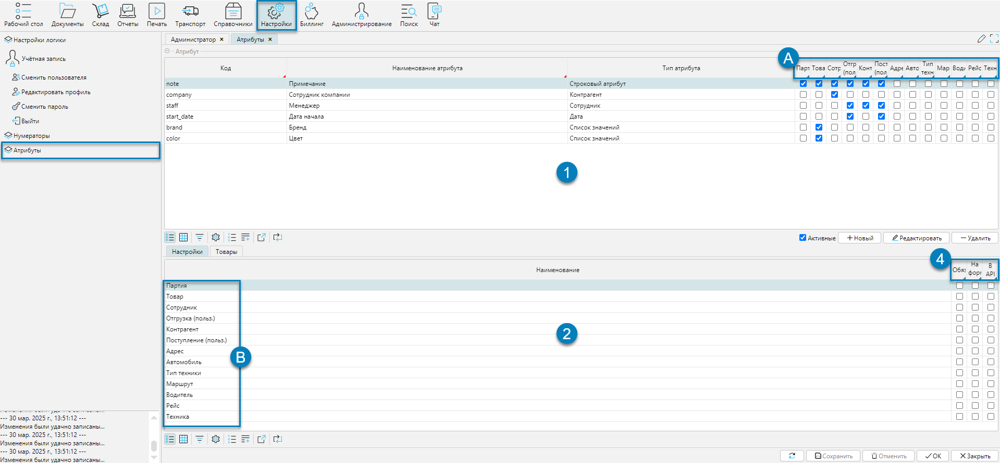

Предугадать все дополнительные свойства, которые могут потребоваться для различных объектов внутри lsFusion WMS, заранее
невозможно. Поэтому в системе предусмотрен универсальный механизм атрибутов, который позволяет пользователю
самостоятельно, без привлечения разработчиков, добавлять нужные свойства, тем самым расширяя функциональность системы.

Справочник доступен из меню **Настройки-Атрибуты** (Рис. 1) 

## Отображение справочника

 
Рис. 1 Форма отображения справочника

Структурно форма состоит из 2-х табличных частей:
1. Список атрибутов (Рис. 1(1)) и колонки объектов (Рис. 1(A)), где атрибуты используются
2. Список объектов (Рис.1(B)) и условия использования атрибутов (Рис. 1(4)), колонки: Обязательный, На форме списка, В API

[//]: # (todo - Зачем вкладка товары?)