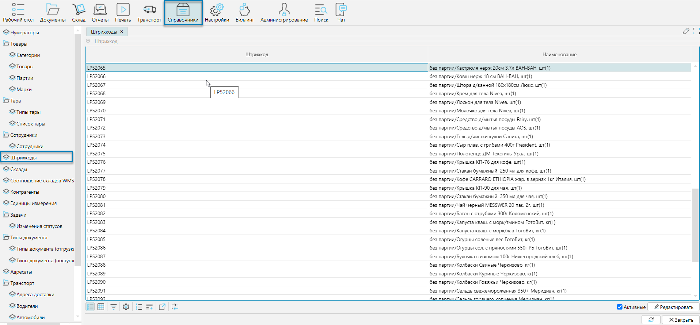

Справочник доступен из меню **Справочники-Штрихкоды** (Рис. 1) или **Рабочий стол-Справочники-Штрихкоды**. 
Справочник содержит все зарегистрированные объекты системы, которым присвоен штрихкод, например: товары, ячейки, документы, сотрудники, и др.

## Отображение справочника

Рис. 1 Форма отображения справочника

Используя фильтр можно найти любой объект по его штрихкоду или наименованию и при необходимости отредактировать его.

## Редактирование справочника
При редактировании справочника вызывается форма, соответствующая типу объекта. 
Для примера приведены фрагменты формы редактирования товара и ячейки хранения.

Рис. 2 Фрагменты разных форм редактирования

