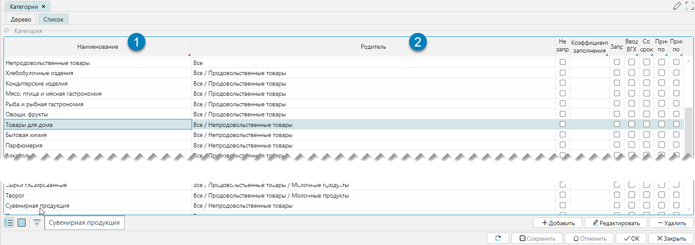
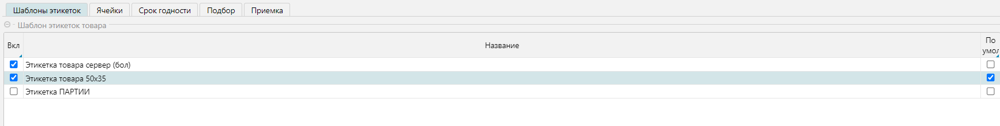
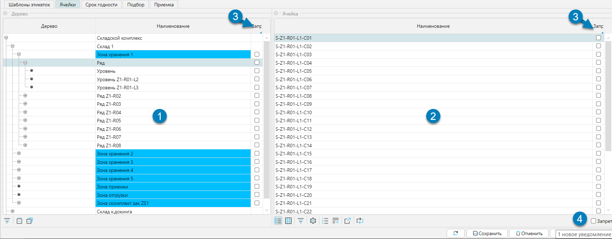
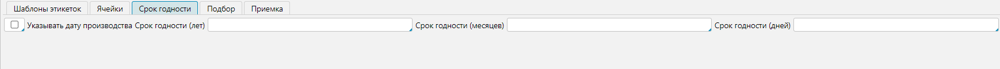
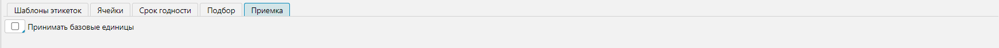

Справочник доступен из меню **Справочники-Категории** (Рис. 1). 
Справочник категорий является классификатором, группирующим товары по определенным признакам. 
На уровне категорий можно задавать отдельные характеристики, которые будут применимы ко всем товарам, 
принадлежащим выбранной категории или к дочерним категориям. При этом:
- если установлены логические значения (флажки), то на уровне товара или дочерней категории их отменить нельзя
- если установлены строковые (числовые) значения, то на уровне товара или дочерней категории они будут отображаться неактивным (_серым_) цветом и 
могут быть изменены при необходимости. При изменении значения последнее будет выделяться активным цветом (_черным_).

## Отображение справочника

Справочник категорий представлен формой отображения имеющей разделение на две вкладки Дерево и Список (Рис. 1(1)), 
различающиеся визуальными и функциональными особенностями. 

 
Рис. 1 Форма отображения справочника, вкладка Дерево

Редактирование справочника вызывается стандартно из верхней табличной части (Рис.1(2)). 
Нижняя табличная часть позволяет связывать этикетки на товары, закрепляя их за товарной категорией (Рис. 1(3)). 
При этом редактирование можно выполнять непосредственной в табличной части, меняя значение флажков "Вкл" и "По умолч.". 
По окончанию процесса редактирование _важно_ не забыть нажать на кнопку "Сохранить" (Рис. 1(4)), 
чтобы сделанные изменения, связанные с этикетками, вступили в силу.

 
Рис. 2 Форма отображения справочника, вкладка Список

Форма отображения представлена линейным списком категорий. 
Колонка "Наименование" - это конечное наименование категории (Рис. 2(1)), 
а колонка "Родитель" (Рис. 2(2)) отражает предшествующие категории по степени их вложенности, используя символ разделить "/".

## Редактирование справочника
 
Рис. 3 Форма редактирования справочника

Форма редактирования справочника, представленная на рисунке 3, может быть поделена на 2 функциональных блока:
1. Категория - свойства категории
2. Вкладки - дополнительные свойства категории

### Свойства категории
- **Родитель** - родительская категория, на один уровень выше текущей в иерархии
- **Наименование** - название текущей категории
- **Не запрашивать количество** - используется для работы с товарами, которые обычно поступают в единственном экземпляре 
Для таких товаров на приемке не запрашивает количество, а автоматически проставляет "1"
- **Коэффициент заполнения** - это соотношение совокупного объема помещенных в ячейку товаров к объему ячейки, 
при достижении которого ячейка будет считаться заполненной. Максимальное значение 1
- **Ввод ВГХ при сканировании** - если установлено, то при сканировании товара будет требоваться ввод Весогабаритных характеристик
- **Со сроком годности** - если установлено, то при вводе товара, будет запрашиваться либо срок годности, либо дата производства. 
Если флаг установлен, то будет доступной новая вкладка: Срок годности, для установки как     
- **Приемка по серийным номерам** - если установлено, приемка товара будет производиться по серийным номерам
- **Приемка по маркам** модуль пока не готов (?)

***
### Вкладка Шаблоны этикеток
Вкладка закрепляет за категорией шаблоны этикеток.
 
Рис. 4 Вкладка шаблоны этикеток

Редактирование производится непосредственно в табличной части изменением значения в колонке "Вкл" (включен, то есть
отчет используется категорией) и установкой значения в колонке "По умолч." (отчет по умолчанию). Флаги влияют на выбор
отчетов для печати для разных форм.

⭐ **Печать этикетки**
- Из меню **Справочники-Товары** с выбором перед печатью шаблона этикетки из списка, закрепленных за товарной
  категорией (флажок "Вкл.") этикеток, по текущей отдельной позиции
- Из меню **Печать-Товар-Печать этикеток товара** печать этикетки по умолчанию (флажок "Умолч.") для всех отмеченных или
  только текущей товарной позиции

👀 **См. также**
- [Подсистема печати](print.md) - загрузка и настройка шаблонов

[//]: # (todo - добавить ссылку на пункт меню для загрузки шаблона)
***

### Вкладка Ячейки
Вкладка отражает доступные для хранения ячейки.
 
Рис. 5 Вкладка Ячейки

На вкладке Ячейка отображается иерархическая структура (дерево) доступных складов и их структур (рис. 5(1)) с детализацией каждого элемента до ячеек (рис.5(2)). 
Для управления отображения запрещенных ячеек на форме присутствует фильтр **Запрет** (Рис. 5(4)). 
Если фильтр установлен, то отражаются только ранее запрещенные ячейки или список будет пуст, если запрещенных ячеек нет. 

Для каждой редактируемой категории можно запретить использовать определенные места хранения, как на уровне складов (рис. 5(1)), так и отдельных ячеек (рис.5(2)). 
Для того чтобы запретить использовать определенные места хранения, необходимо установить флаг в поле колонки **Запр** (Рис. 5(3)). 

⭐ **Логика работы**
- Логика работы построена таким образом, что по умолчанию все ячейки разрешены для работы
- Подход с разрешенными ячейками по умолчанию обеспечивает быструю организацию процессов приемки товара на начальном
  этапе работы склада.

Существует несколько понятий, связанных с размещением товара:
- Свободное перемещение. Если кладовщику оно разрешено, то он может положить товар в ячейку, даже если хранение товара там запрещено.
- Плановое размещение. При плановом размещении считается план и кладовщик следует плану по размещению товара. 
При этом может действовать настройка разрешающая отклонение от плана или нет.  
***

### Вкладка Срок годности
Вкладка доступна, если в разделе **Категории** установлен флажок **Со сроком годности**.
 
Рис. 5 Вкладка Срок годности

При приемке товаров текущей категории будет запрошена дата производства, если установлен чекбокс "Указывать дату производства".
При этом срок годности рассчитается автоматически относительно даты производства и уставленных значений срока годности лет, месяцев, дней.
***

### Вкладка Подбор
Вкладка отвечает за то, как будет планироваться подбор для товаров, входящих в категорию.
 
Рис. 7 Вкладка Подбор

Настройки отвечают за особенности планирования товаров, входящих в текущую категорию, при отгрузке. 
Более подробно описано в разделе Подбор.
***

### Вкладка Приемка
Вкладка отвечает за то, в каких единицах будет приниматься товар, входящий в категорию, на приемке.
 
Рис. 8 Вкладка Приемка

Товар, как правило, принимается и учитывается упаковками, то есть так, как он обычно и поступает на склад.
Но иногда бывает необходимо принимать товара в базовых единицах (_например, в штуках_).
При установке чекбокса "Принимать базовые единицы" на приемке товара при считывании штрих кода упаковки,
количество товара при приемке будет определяться количеством базовых единиц, входящих в упаковку,
и учитываться товар на складе будет в базовых единицах, а не в упаковках.   

