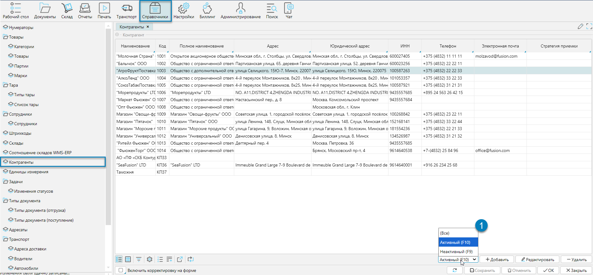
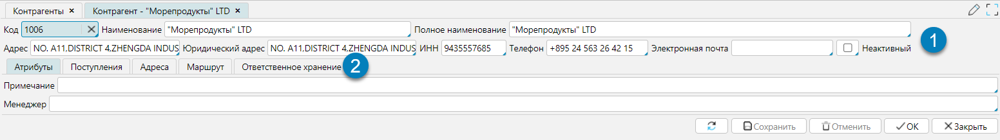

## Отображение справочника

Справочник контрагентов - это инструмент, который помогает управлять информацией о партнёрах, таких как поставщики,
покупатели, перевозчики и другие участники цепочки поставок.  
Справочник доступен из меню **Справочники-Контрагенты** (рис. 1) или **Рабочий стол-Справочники-Контрагенты**. 
Справочник может как импортироваться из внешней системы, так и создаваться и редактироваться в lsFusion WMS. 

  
Рис. 1 Форма отображения справочника

Для управления отображением контрагентов используют фильтр (Рис. 1 (1)). Фильтр позволяет отобразить **Активных** и
(или) **Неактивных** контрагентов. Неактивные контрагенты - это те, с которыми по каким-либо причинам не ведется
деятельность и они не могут быть выбраны в документах.

## Редактирование справочника

При редактировании контрагентов (Рис. 2) на форме отображается несколько функциональных групп:
- общие реквизиты клиента: 
  - **Код** - код контрагента, который является уникальным идентификатором
  - **Наименование** - краткое наименование контрагента
  - **Полное наименование** - полное наименование клиента
  - **Адрес** - физический адрес контрагента
  - **Юридический адрес** - юридический адрес контрагента
  - **ИНН** - идентификационный номер налогоплательщика
  - **Телефон**
  - **Электронная почта**
  - **Неактивный** - если флажок установлен, то клиент будет считаться неактивным. 
Такого клиента нельзя выбрать при оформлении приходно / расходных операций, но он будет виден в документах движения.
- отдельные вкладки, связанные со своим списком дополнительных реквизитов
  - Атрибуты
  - Поступления - отображаются все документы-поступления от контрагента
  - Адреса - настройки дополнительного модуля "Транспорт", которые описаны в разделе (?)
  - Маршруты - настройки дополнительного модуля "Транспорт", которые описаны в разделе (?)
  - Ответственное хранение 

  
Рис. 2 Форма редактирования справочника

