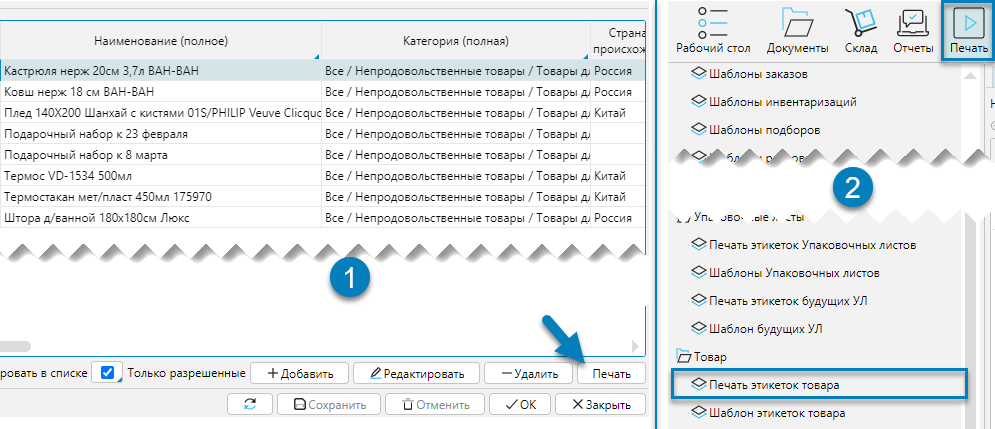
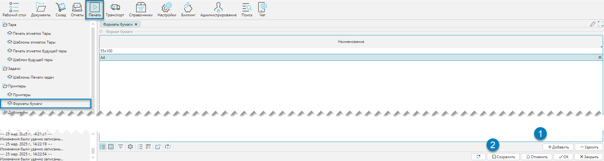
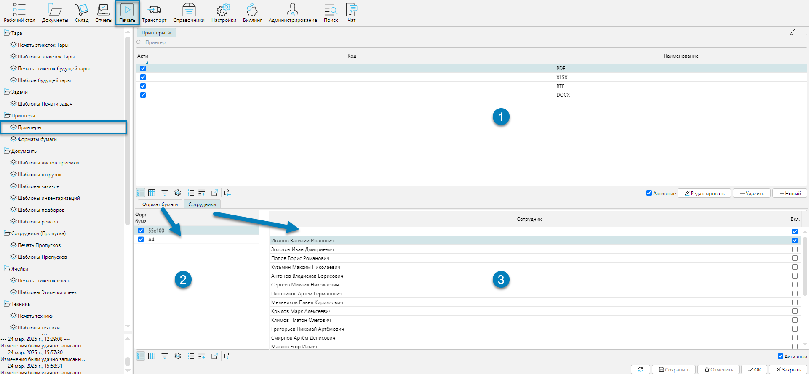

Подсистема печати нужна для автоматизации и удобства работы с документами, отчётами, этикетками.  
Она выполняет несколько ключевых функций:
- Создание и печать документов с поддержкой различных типов принтеров и форматов документов, что обеспечивает гибкость и
  удобство отправки печатных форм, адаптируясь под конкретные требования пользователей
- Поддержка работы с шаблонами документов и этикеток

## Печать документов

Печать документов может быть выполнена из форм при нажатии на кнопку **Печать** на форме или через меню 
**Печать-Печать < _название документа_ >**. В качестве примера рассмотрим печать этикетки товара.

 
Рис. 1 Печать этикетки 

Слева (Рис. 1(1)) печать из формы **Товары** (см. меню: Справочники-Товары-Товары) и печать из меню 
**Печать-Товар-Печать этикеток товара** (Рис. 1(2)).
***

## Настройка печати

Настройку печати можно разделить на три этапа:
- Общие для всех документов:
  - Установка формата бумаги
  - Определение доступных принтеров, их связи с форматами бумаги и пользователями
- Настройки для выбранного документа 
  - Создание, редактирование и загрузка шаблонов документов

### Установка формата бумаги

В системе можно задать разные форматы (размеры) бумаги для документов (Рис. 11). 

 
Рис. 11 Отображение справочника форматов бумаги

Создание новых значений производится непосредственно в табличной части после нажатия на кнопку **Добавить**
(Рис. 11(1)). После нажатия на кнопку добавится пустая запись, для которой в колонке **Наименование** необходимо внести
требуемое значение. Для редактирования уже созданной записи достаточно перейти в табличной части на нужную запись и
кликнуть по ней мышью и строка станет доступной для редактирования. После завершения редактирования табличной необходимо нажать
на кнопку **Сохранить** (Рис. 11(2)), чтобы сохранить внесенные изменения.

💬 **Примечание**
- Вносимые значения носят информационный характер
- Для того чтобы шаблон документа мог быть распечатан, он должен быть привязан к своему формату бумаги

### Доступные принтеры и форматы документов

В системе можно настроить принтеры и форматы документов, в которые можно выгрузить формируемый документ, а также связать
их с определенными сотрудниками. Форма, в которой это можно настроить доступна из меню **Печать-Принтеры-Принтеры**.

 
Рис. 12 Принтеры

- Форма состоит из шапки (Рис. 12(1)): 
  - со списком доступных для вывода в файл форматов документов. По умолчанию присутствует 4 предопределенных формата
    документов, в который может быть выгружен шаблон документа: PDF, XLSX, RTF, DOCX  
  - со списком сетевых принтеров (см. примечание). Имена принтеров записываются так, как они определены в операционной
    системе
- Связанных табличных форм
  - форматов бумаги (Рис. 12(2))
  - сотрудников, за которыми могут закреплены отдельные форматы документов и принтеры (Рис. 12(3)) 

💬 **Примечание**
- Предопределенные форматы не могут быть удалены. При попытке удаления будет выдано соответствующее предупреждение
- Печать документов на локальном принтере. Так как сервер системы не располагает информацией о локальных устройствах, то для
  печати на локальном принтере, необходимо при печати выбрать один из 4-х доступных форматов: PDF, XLSX, RTF, DOCX.
  Система после создания документа, откроет соответствующее, выбранному формату, приложение. Из открывшегося приложения,
  используя инструменты печати приложения, можно распечатать документ как на локальном, так и на сетевом принтере
- При печати документов наиболее удобным является использование сетевого принтера или выбор формата PDF, так как в этом
  случае исключаются конечные правки документа.