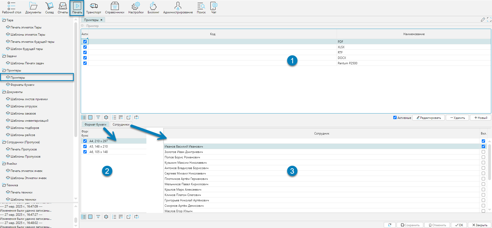

В системе можно настроить принтеры и связать их с сотрудниками системы. 
Настройка принтеров доступна из меню **Печать-Принтеры-Принтеры**.

## Отображение справочника

 
Рис. 1 Форма отображения справочника

- Форма состоит из табличной формы **Принтер** (Рис. 1(1)):
    - со списком доступных для вывода в файл документов. По умолчанию присутствует 4 предопределенных типа
      файлов, в который может быть выгружен шаблон документа: PDF, XLSX, RTF, DOCX
    - со списком сетевых принтеров. Имена принтеров записываются так, как они определены в операционной
      системе
- Связанных табличных форм
    - форматов бумаги (Рис. 1(2))
    - сотрудников, за которыми могут закреплены отдельные форматы документов и принтеры (Рис. 1(3))

💬 **Примечание**
- Предопределенные типы файлов не могут быть удалены. При попытке удаления будет выдано соответствующее предупреждение
- Печать документов на локальном принтере. Так как сервер системы не располагает информацией о локальных устройствах, то для
  печати на локальном принтере, необходимо выбрать один из 4-х типов файлов: PDF, XLSX, RTF, DOCX.
  Система после создания документа, откроет соответствующее, выбранному типу файла, приложение. Из открывшегося приложения,
  используя инструменты печати приложения, можно распечатать документ как на локальном, так и на сетевом принтере
- При печати документов наиболее удобным является использование сетевого принтера или выбрать тип файла PDF, так как в этом
  случае исключаются конечные правки документа.

## Редактирование справочника

 
Рис. 2 Форма редактирования справочника

Присутствует особенность форм редактирования справочника Принтеров:

- Для предопределенных (Рис. 2(1)) типов файлов (PDF, XLSX, RTF, DOCX), в которые может быть выгружен шаблон документа,
  не отображаются вкладки: Формат бумаги и Примечание, так как это не может влиять на содержимое файла.
- Для принтеров (в примере Pantum P2500, Рис. 2(2))) нужно связать принтер с возможными форматами бумаги. При печати
  документов будут доступны шаблоны, у которых совпадают форматы бумаги принтера с форматами, закрепленные за шаблонами

[//]: # (todo - Проверить на локальной базе с настройками принтера и разными форматами)

Типы принтеров можно закрепить за конкретными пользователями. Например, существует необходимость запретить кому-то
вносить правки в документ, или наоборот разрешить, то для решения этих задач существует закрепление принтеров за
сотрудником. Для закрепления принтера надо поставить в колонке **Вкл.** (Рис. 2(1)) флажок напротив нужных сотрудников. 
Для сотрудников, для которых нет закрепленных принтеров, доступны все принтеры системы. 

Флажок **Активный** - фильтр, который отражает, когда установлен, только активных сотрудников. Если фильтр отменить, то
можно увидеть всех сотрудников, которые когда-либо работали.