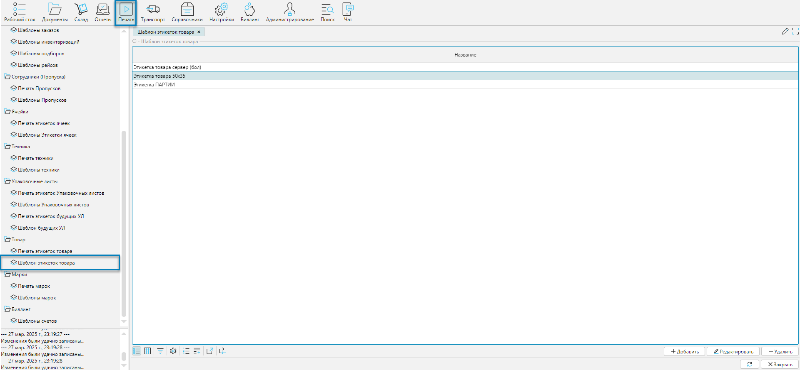
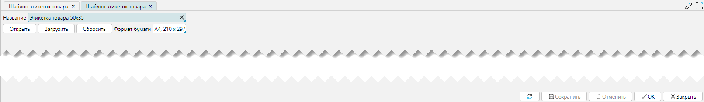

Шаблоны документов представляют собой файл формата XML с расширением JRXML. Создание и редактирование файла возможно в
бесплатном редакторе JasperSoft Studio. Выполнить небольшие правки, при некоторой сноровке, можно и в обычном текстовом
редакторе. 

Измененные или новые шаблоны документов подключаются через меню **Печать-Шаблон < имя документа >**, который вызывает
форму отображения со списком шаблонов. В целом большинство форм отображения и редактирования шаблонов работают одинаково, 
что говорит об универсальности подхода к использованию и редактированию шаблонов.

Рассмотри на примере Шаблон этикеток товара.

## Форма отображения

 
Рис. 1 Форма отображения

## Форма редактирования

 
Рис. 2 Форма редактирования

Органы управления:
- **Название** - название шаблона, как он будет доступен на форме Шаблон печати для выбора
- **Открыть** - при нажатии на кнопку, если присутствует ранее созданный шаблон, то он сохраниться в папку Downloads с
  уникальным буквенно-цифровым именем. Сделано, это для того, чтобы текущий шаблон можно было выгрузить для будущей правки
- **Загрузить** - при нажатии на кнопку высветится форма диалога открытия файлов. Необходимо найти файл нужного шаблона и
  нажать на форме диалога кнопку **Открыть (Open)** для загрузки шаблона в базу данных системы
- **Сбросить** - кнопка сбрасывает ранее загруженный шаблон
- **Формат бумаги** - при нажатии вызывается справочник Форматов бумаги для выбора нужного значения 
