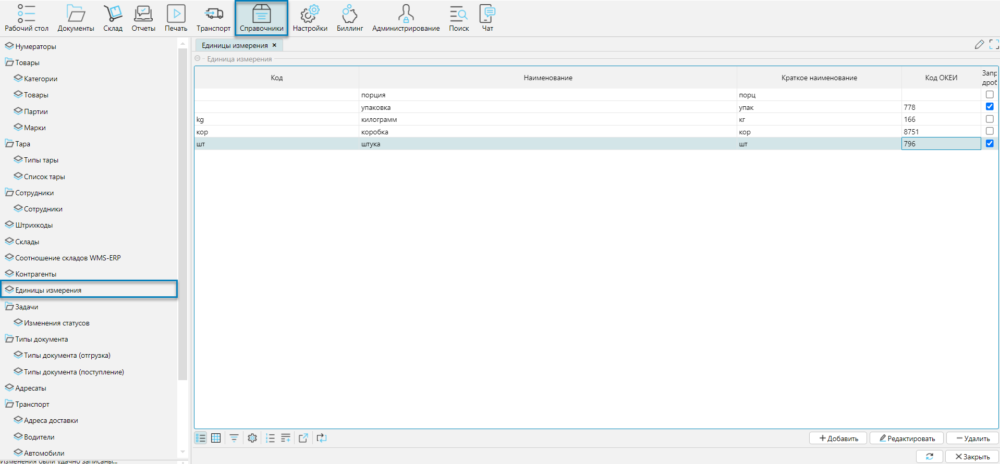

Справочник доступен из меню **Справочники-Единицы измерения** (Рис. 1).  
Справочник используется для стандартизации и упрощения работы с различными типами товаров. Он помогает управлять данными
о единицах измерения, которые применяются для учета, хранения и перемещения товаров.

## Отображение справочника
 
Рис. 1 Форма отображения справочника

## Редактирования справочника
 
Рис. 2 Форма редактирования справочника

Для каждой единицы измерения указывают:
- **Код** - идентификатор единицы измерения в системе
- **Наименование** - принятое название единицы измерения
- **Краткое наименование** - сокращенное обозначение единицы измерения, которое отображается на формах (документах, отчетах и т.д.)
- **Запретить дробные** - если флажок установлен, то системе запрещено планировать подбор дробными количествами. 
Например, если идет подбор в штуках, то запрет дробных не позволит запланировать подбор на 0,4 штуки.

