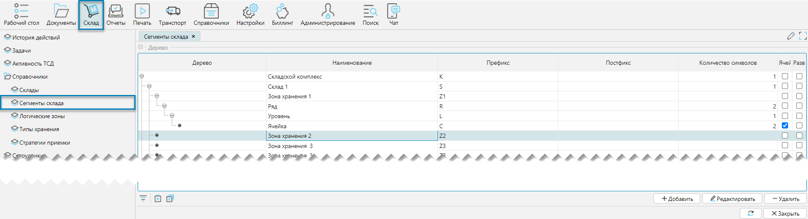
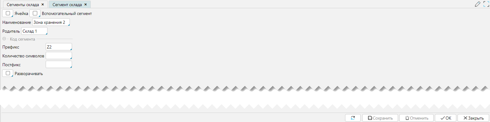

Справочник сегментов задаёт структуру-шаблон построения топологии склада, определяет наименования, состав и 
взаимосвязи, входящих в структуру элементов.    

Справочник сегменты склада доступен из меню **Склад-Справочники-Сегменты склада** (рис. 1).

[//]: # (todo - уточнить насчет импорта из внешней системы, скорее всего что нет)

## Отображение справочника
Справочник представлен на форме в виде иерархической структуры (Рис. 1).

 
_Рис. 1 Форма отображения справочника_

## Редактирование сегмента
 
_Рис. 2 Форма редактирования сегмента_

Описание элементов ввода:
- **Ячейка** - признак, указывающий, что текущий сегмент является базовой (минимальной) единицей складской структуры,
  которая участвует в планировании при выполнении складских операций и используется для размещения товаров 
- **Вспомогательный сегмент** - признак, указывающий, что текущий сегмент не участвует в планировании при 
  выполнении складских операций. Используется для выделения каких то зон (ворота, колонны, подсобные помещения и т.д.),
  которые не могут служить для размещения товара
- **Наименование** - наименование сегмента
- **Родитель** - родительская категория, на один уровень выше текущей в иерархии
- **Префикс** - символ(ы) с которых начинается уникальный кода сегмента 
- **Количество символов** - количество символов, отводимых под порядковый номер внутри кода сегмента
- **Постфикс** - символ(ы) которыми завершается код сегмента 
- **Разворачивать** - если отмечено, то при открытии формы [**Топология**](topologyeditor.md) элементы данного 
  уровня будут автоматически развернуты в топологии склада 

<info>
  **Примечания:**
  - Система не ограничивает количество уровней в топологии, что позволяет описывать любые структуры
  - Какой то особой привязки к наименованию сегментов не существует, что делает систему универсальной при выборе 
    наименований для сегментов от сложившихся в WMS названий до специфичных
</info>
