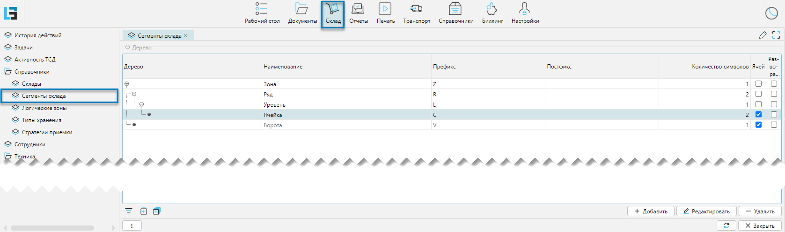
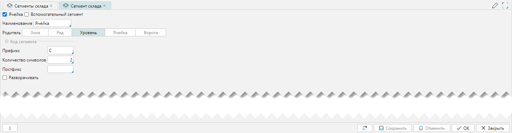

Справочник сегменты склада доступен из меню **Склад-Справочники-Сегменты склада** (рис. 1). 
Справочник может как импортироваться из внешней системы, так и создаваться и редактироваться в lsFusion WMS. 
Справочник предназначен для определения зон внутри склада, которые необходимы для оптимизации хранения и управления товарами. 
Справочник представлен на форме с вкладками в виде иерархической структуры (Рис. 1). 

## Отображение справочника

 
Рис. 1 Форма отображения справочника

## Редактирование справочника
 
Рис. 2 Форма редактирования справочника

Описание элементов ввода:
- **Ячейка** - признак, указывающий, что текущий сегмент является базовой (минимальной) единицей складской структуры
- **Вспомогательная зона** - признак, указывающий, что текущий сегмент не используется непосредственно в складских
  операциях
- **Наименование** - наименование сегмента
- **Родитель** - родительская категория, на один уровень выше текущей в иерархии
- **Префикс, Количество символов, Постфикс** - это элементы уникального кода сегмента склада, который является составной
  частью штрихкода адреса хранения
- **Разворачивать** - если отмечено, то при открытии формы **Топология** элементы данного уровня будут автоматически
  развернуты в иерархии склада 