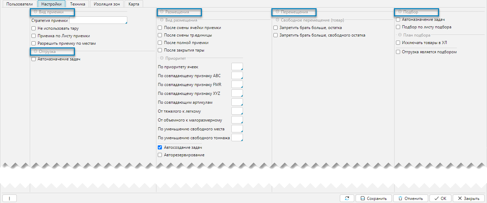

Справочник складов — это инструмент, который содержит информацию о всех складах, доступных в системе. Играет ключевую
роль в управлении складскими операциями и обеспечивает структурированный подход к работе.

Справочник склады доступен из меню **Склад-Справочники-Склады** (рис. 1) или **Справочники-Склады**. Справочник 
может как импортироваться из внешней системы, так и создаваться и редактироваться в lsFusion WMS.  

## Отображение справочника

 
_Рис. 1 Форма отображения справочника_

Справочник представлен на форме (Рис. 1) с вкладками:
- **Дерево** - в виде иерархической структуры 
- **Список** - в виде списка  

## Редактирование склада

 
_Рис. 2 Форма редактирования склада_

Форма содержит основные элементы для редактирования и вкладки, предназначенные для настройки дополнительных параметров:
- **Название** - название склада
- **Код** - код склада. Значение кода используется, как символ(ы) начала кода элементов структуры склада при 
  построении топологии. Значение должно быть уникальным по отношению ко всем вводимым складам  
- **Родитель** - родительская категория, на один уровень выше текущей в иерархии

### Вкладка Пользователи

 
_Рис. 3 Вкладка Пользователи_

Содержание табличной части отражает всех зарегистрированных пользователей в системе. Колонки табличной части:
- **logName** - зарегистрированное имя пользователя
- **Разрешить** - флажок устанавливает разрешение пользователю для работы с текущим складом. Так как склады 
  представляют собой иерархическую структуру, то разрешения данные на уровень выше, не могут быть изменены на 
  текущем уровне. 
***

### Вкладка Настройки
Вкладка содержит настройки технологических операций

 
_Рис. 4 Вкладка настройки_

Настройки технологических операций:
- Вид приемки
- Отгрузка
- Размещения
- Перемещения
- Подбор

[//]: # (todo - требует более детального уточнения, нужны будут потом ссылки на технологические операции Сотрудники_Склады.mp4, 0:50:32)
***

### Вкладка Техника
Вкладка отвечает за закрепление техники за складом, что необходимо для планировании задач
 
_Рис. 5 Вкладка Техника_

Элементы управления:
- **Приоритет технике** - флажок отвечает за распределение задач: 
  - если флаг установлен, то при планировании задач в первую очередь распределяются задачи для техники, а затем для
    сотрудников
  - если флаг не установлен, то при планировании задач в первую очередь распределяются задачи для сотрудников, а 
    затем для техники
- **Вкл** - колонка отвечает за закрепление техники за складом. Техника может быть закреплена как, непосредственно 
  на текущем складе, так и на уровнях выше текущего склада. Для этой цели используется специальный формат 
  отображения данных, позволяющий визуально различать варианты закрепления техники:
  - если техника не закреплена, информация об этом отображается неактивным серым цветом 
  - если техника закреплена на уровне выше текущего склада, информация об этом отображается неактивным серым цветом. 
    При этом отменить такое закрепление на уровне текущего склада нельзя
  - если техника закреплена на уровне текущего склада, информация об этом отображается активным черным цветом
***

### Вкладка Изоляция зон
Вкладка определяет изолированные зоны
 
Рис. 6 Вкладка Изоляция зон

Использует алгоритмы нахождения кратчайших путей между изолированными зонами для эффективного формирования задач по
размещению с учетом неоднородности складских помещений.

[//]: # (todo - раздел требует доработки)
***

### Вкладка Карта
Показывает положение объекта (склада)
 
_Рис. 7 Вкладка Карта_

- **Адрес** - адрес торгового объекта (склада), координата меняется при перемещении объекта
- **Широта, Долгота** - географические координаты, координата меняется при перемещении объекта
- **Рассчитать координаты** - рассчитывает координаты по значению в поле **Адрес**, при этом метка объекта переместится
  автоматически в точку на карте  

<info>
**Примечания:**
- Вкладка Карта доступна, если подключен модуль **Транспорт**
- Местоположение объекта также показывается на карте в маршрутах
- Расчет координат по адресу работает, если подключена услуга API Keys Google (платно)
</info>

