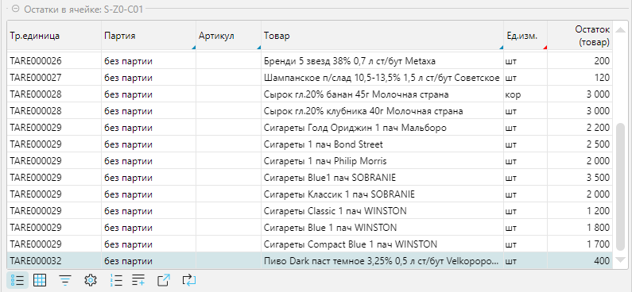

Форма Топология является ключевым инструментом системы, обеспечивающим структуризацию данных, необходимых для 
организации топологии склада и его элементов, решает задачи настройки и визуализации.

Справочник топологий доступен меню **Склад-Топология** (Рис. 1). 

## Форма топологии

 
_Рис. 1 Форма отображения_

Форма позволяет: 
- Вносить изменения в топологию склада, создавать и редактировать склады, сегменты, ячейки
- Создавать новые сегменты и ячейки, используя механизмы копирования и генератора в панели дерева топологии, а также 
  добавлять и редактировать отдельные ячейки из вкладки список 
- Просматривать содержание ячеек
- Визуально отображать 3D модель складского пространства с контролем размещения и заполнения 

Структурно форма состоит:
- Вкладка **Топология**, которая состоит из 3-х панелей: 
  - панель **Дерево** - отображает топологию складов
  - панель **Остатков в ячейке** - выводит содержимое ячейки (по умолчанию свернуто)
  - панель **Легенда модели** - выводит цвета легенды для 3D модели (по умолчанию свернуто) 
- Вкладка **Сегменты склада** - отображает справочник [сегментов склада](segments.md)
- Вкладка **Список** - список ячеек относительно текущего элемента дерева топологии
- Вкладка **3D** - визуальное представление элементов топологии относительно текущего уровня дерева топологии  

### Панель Дерева топологии
 
_Рис. 2 Панель Дерева топологии_

Особенности:
- Панель инструментов является контекстно-зависимой - ее содержание меняется при проходе по дереву топологии (см. 
  таблицу 1)
- В дерево топологии входят разные типы элементов (склады, сегменты, ячейки), поэтому создание нового или 
  редактирование существующего элемента производится типичными для этого элемента формами редактирования  

Таблица 1. Содержание панели инструментов от типа элемента

| Кнопка        | тип Склад | тип Сегмент | тип Ячейка | Действие                                                                              |
|---------------|---------------|-----------------|----------------|---------------------------------------------------------------------------------------|
| + Сегмент     | да            | да              | -              | Добавляет новый сегмент                                                               |
| + Склад       | да            | -               | -              | Добавляет новый склад                                                                 |
| Редактировать | да            | да              | да             | Редактирует элемент                                                                   |
| Удалить       | да            | да              | да             | Удаляет элемент (если нет движения)                                                   |
| Генерировать  | -             | да              | -              | Создает элементы структуры топологии в соответствии со структурой сегменты склада |
| Копировать    | да            | да              | да             | Копирует и воссоздает новый элемент со всем набором дочерних элементов            |
***

### Копирование элементов
Панель инструментов дерева топологии имеет специальный механизм, позволяющий создавать склады, сегменты, ячейки на 
основании копируемой области, наследуя входящие в нее элементы: на уровне склада можно создать копию склада, на уровне 
сегмента - копию сегмента, на уровне ячейки - копию ячейки. При этом копии будут отличиться от родителя только кодом 
элементов.  Запускается механизм нажатием на кнопку **Копировать** (Рис. 2), после нажатия на которую, вызывается 
форма редактирования копируемой области (склада, сегмента, ячейки). При сохранении данных формы редактирования 
создается новая область. Использование механизма копирования позволяет значительно сократить время на создание 
схожих элементов складской топологии.
***

### Генератор топологии
Создание групп сегментов и ячеек выполняется в соответствии со структурами-шаблонами, определенными в справочнике 
[Сегменты склада](segments.md), используя механизм генератора топологии. Генератор вызывается по кнопке 
**Генерировать** панели инструментов дерева топологии. При этом если уровни дерева топологии уже имеют ранее 
созданную вложенность (кроме типов ячейка и склад, см. таб. 1), то можно выполнить операцию относительного любого 
уровня. При нажатии на кнопку **Генерировать** появляется форма **Генератор топологии**, в которой необходимо 
выбрать создаваемую структуру и отметить количество, создаваемых элементов, не пропуская верхние уровни. 

 
_Рис. 3 Генератор топологии_

В примере создается один ряд, один уровень и 2 ячейки. Результат работы генератора на рисунке ниже. 

 
_Рис. 4 Результат работы генератора_
***

### Панель Остатков в ячейке
Панель отражает остатки по выбранной ячейке

 
_Рис. 5 Остатки в ячейке_

Смена содержимого ячейки производится либо: 
- в дереве топологии переходом на нужную ячейку ([Рис. 2](topologyeditor.md#панель-дерева-топологии))
- в дереве топологии переходом на сегмент или склад, тогда будет отражаться содержимое первой ячейки в сегменте   
- либо во вкладке [Список](topologyeditor.md#вкладка-список)

Колонки: Партия, Артикул, Товар, Ед. изм. являются редактируемыми. При необходимости можно исправить некорректно 
введенные данные. 
***

### Панель Легенда модели
Назначает цветовую легенду заполненности ячеек

 
_Рис. 6 Легенда модели с формой выбора цвета_

Ячейки формы кликабельны:
- **% Заполнения** - это процент заполнения ячейки от максимального объема, значение для ввода: числовое целое
- **Цвет** - это цвет ячейки на 3D модели. Цвет задается кликом мышью по ячейке, при этом на экране появится форма 
  выбора цвета. Завершение работы с формой выбора цвета по клавише Enter 
***

## Вкладка Список
Отображает список ячеек в зависимости от выбранного склада, сегмента или ячейки в дереве топологии

 
_Рис. 7 Вкладка список_

<info>
Примечание:
- Кнопка **+ Добавить** отображается только на уровне сегментов склада, для того чтобы добавляемая ячейка всегда 
  имела привязку к текущему сегменту топологии склада
</info>
***

## Редактирование ячейки
 
_Рис. 8 Редактирование ячейки_

Форма редактирования ячейки (Рис. 8) может быть условно разделена на 2 функциональные части:
1. Общие свойства ячейки 
2. Вкладки - дополнительные свойства ячейки

Общие свойства:
- **ABC, FMR, XYZ** - анализ влияют на планирование размещения
- **Логическая зона**
- **Изолированная зона**
- **Приоритет планирования подбора**
- **Сегмент** - тип сегмента, возможные варианты - ячейка или ворота
- **Штрихкод** - штрихкод ячейки, только по чтению
- **Код** - код ячейки, уникальное символьное значение, длина определяется в настройках
  [сегмента](segments.md#редактирование-сегмента) (свойство Количество символов)
- **Форматированный код**
- **Группа ячеек** - принадлежность к родительскому сегменту
- **Максимальная нагрузка, кг** - максимальная нагрузка, на которую рассчитана ячейка
- **X, Y, Z мм** - координаты расположения ячейки для 3D модели, при этом ось Z соответствует высоте
- **Высот, Ширина, Глубина мм** - габаритные размеры ячейки
- **Вместимость м3** - объем, только по чтению, рассчитывается автоматически, при заполнении всех характеристик 
  габаритных размеров 

### Вкладка Тип назначения ячеек
Устанавливает тип назначения ячейки, который учитывается в технологических операциях 

 
_Рис. 9 Вкладка Тип назначения ячеек_

Одна ячейка может иметь привязку к разным типам.
***

### Вкладка Шаблон этикетки
Отображает, закрепленные за ячейкой шаблоны этикеток

 
_Рис. 10 Вкладка Шаблон этикетки_

<info>
Примечание:
- Этикетку можно распечатать из вкладки на текущею ячейку или из меню **Печать-Ячейки-Печать этикеток ячеек**, где 
  можно распечатать этикетки на группу ячеек
- Загрузить шаблоны можно из меню **Печать-Ячейки-Шаблоны этикетки ячеек**
</info>

### Размещение
### Тип техники
### Товары
### Текущие остатки
### Подбор

***

## Вкладка 3D
Визуализирует топологию складского помещения на 3D модели склада

 
_Рис. 16 Вкладка 3D модель_

Форма вкладки 3D модели позволяет:
- вращать изображение мышью по вертикали и горизонтали (левая кнопка нажата), разворачивая модель так, как это 
  удобно для просмотра
- сдвигать изображение мышью по вертикали и горизонтали (правая кнопка нажата)
- менять масштаб изображения, используя колесо прокрутки мыши
- визуализирует заполненность ячеек в соответствии с цветовой легендой
- незаполненные ячейки отображаются светло зеленым цветом (рис. 9, синяя стрелка справа)  
- текущая ячейка отображается розовым цветом (рис. 9, синяя стрелка слева)
- выбирать интересующие ячейки, кликая по ним мышью. При этом, если перейти в панель **Остатков по ячейке** или вкладку 
  **Список** можно увидеть выбранную ячейку