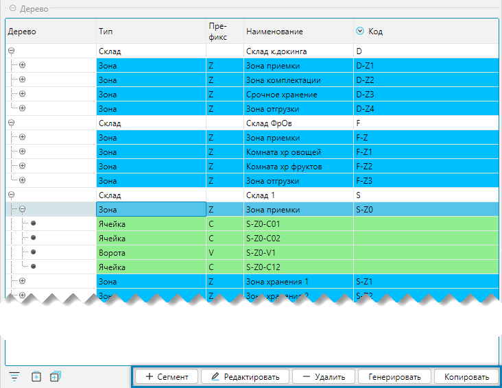
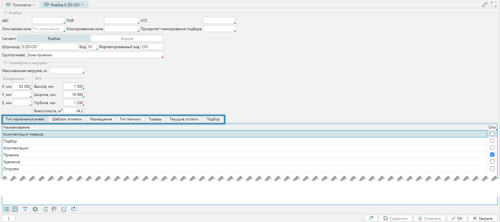

Форма Топология является ключевым инструментом системы, обеспечивающим структуризацию данных, необходимых для 
организации топологии склада и его элементов, решает задачи настройки и визуализации.

Справочник топологий доступен меню **Склад-Топология** (Рис. 1). 

## Форма топологии

 
_Рис. 1 Форма отображения_

Форма позволяет: 
- Вносить изменения в топологию склада, создавать и редактировать склады, сегменты, ячейки
- Создавать новые сегменты и ячейки, используя механизмы копирования и генератора в панели дерева топологии, а также 
  добавлять и редактировать отдельные ячейки из вкладки список 
- Просматривать содержание ячеек
- Визуально отображать 3D модель складского пространства с контролем размещения и заполнения 

Структурно форма состоит из 4-х вкладок:
- Вкладка **Топология** 
- Вкладка **Сегменты склада** - отображает справочник [сегментов склада](segments.md)
- Вкладка **Список** - список ячеек, который отображается относительно текущего элемента дерева топологии
- Вкладка **3D** - визуальное представление элементов топологии относительно текущего уровня дерева топологии  

## Вкладка Топология
- Вкладка **Топология** состоит из 3=х вертикальных панелей:
  - панель **Дерево** - отображает топологию складов
  - панель **Остатков в ячейке** - выводит содержимое ячейки (по умолчанию свернуто)
  - панель **Легенда модели** - выводит цвета легенды для 3D модели (по умолчанию свернуто)

 
_Рис. 2 Вкладка топология_

### Панель Дерево топологии
 
_Рис. 3 Панель Дерева топологии_

Особенности:
- Панель инструментов является контекстно-зависимой - ее содержание меняется при проходе по дереву топологии (см. 
  таблицу 1)
- В дерево топологии входят разные типы элементов (склады, сегменты, ячейки), поэтому создание нового или 
  редактирование существующего элемента производится типичными для этого элемента формами редактирования  

Таблица 1. Содержание панели инструментов от типа элемента

| Кнопка        | тип Склад | тип Сегмент | тип Ячейка | Действие                                                                              |
|---------------|---------------|-----------------|----------------|---------------------------------------------------------------------------------------|
| + Сегмент     | да            | да              | -              | Добавляет новый сегмент                                                               |
| + Склад       | да            | -               | -              | Добавляет новый склад                                                                 |
| Редактировать | да            | да              | да             | Редактирует элемент                                                                   |
| Удалить       | да            | да              | да             | Удаляет элемент (если нет движения)                                                   |
| Генерировать  | -             | да              | -              | Создает элементы структуры топологии в соответствии со структурой сегменты склада |
| Копировать    | да            | да              | да             | Копирует и воссоздает новый элемент со всем набором дочерних элементов            |
***

#### Копирование элементов
Панель инструментов дерева топологии имеет специальный механизм, позволяющий создавать склады, сегменты, ячейки на 
основании копируемой области, наследуя входящие в нее элементы: на уровне склада можно создать копию склада, на уровне 
сегмента - копию сегмента, на уровне ячейки - копию ячейки. При этом копии будут отличиться от родителя только кодом 
элементов.  Запускается механизм нажатием на кнопку **Копировать** (Рис. 2), после нажатия на которую, вызывается 
форма редактирования копируемой области (склада, сегмента, ячейки). При сохранении данных формы редактирования 
создается новая область. Использование механизма копирования позволяет значительно сократить время на создание 
схожих элементов складской топологии.
***

#### Генератор топологии
Создание групп сегментов и ячеек выполняется в соответствии со структурами-шаблонами, определенными в справочнике 
[Сегменты склада](segments.md), используя механизм генератора топологии. Генератор вызывается по кнопке 
**Генерировать** панели инструментов дерева топологии. При этом если уровни дерева топологии уже имеют ранее 
созданную вложенность (кроме типов ячейка и склад, см. таб. 1), то можно выполнить операцию относительного любого 
уровня. При нажатии на кнопку **Генерировать** появляется форма **Генератор топологии**, в которой необходимо 
выбрать создаваемую структуру и отметить количество, создаваемых элементов, не пропуская верхние уровни. 

 
_Рис. 4 Генератор топологии_

В примере создается один ряд, один уровень и 2 ячейки. Результат работы генератора на рисунке ниже. 

 
_Рис. 5 Результат работы генератора_
***

### Панель Остатков в ячейке
Панель отражает остатки по выбранной ячейке

 
_Рис. 6 Остатки в ячейке_

Смена содержимого ячейки производится либо:
- в **дереве топологии** переходом на склад, сегмент или ячейку (_при выборе сегмента или склада остатки отражаются по 
  первой ячейке_)
- во вкладке **список** переходом на нужную ячейку
***

### Панель Легенда модели
Назначает цветовую легенду заполненности ячеек для [3D модели](topologyeditor.md#вкладка-3d)

 
_Рис. 7 Легенда модели с формой выбора цвета_

Ячейки формы кликабельны:
- **% Заполнения** - это процент заполнения ячейки от максимального объема, значение для ввода: числовое целое
- **Цвет** - это цвет ячейки на 3D модели. Цвет задается кликом мышью по ячейке, при этом на экране появится форма 
  выбора цвета. Завершение работы с формой выбора цвета по клавише Enter 
***

## Вкладка Сегменты склада
Открывает содержание справочника [Сегменты склада](segments.md) в отдельной вкладке

 
_Рис. 8 Вкладка Сегменты склада_
***

## Вкладка Список
Отображает список ячеек в зависимости от выбранного склада, сегмента или ячейки в дереве топологии

 
_Рис. 9 Вкладка Список_

<info>
**Примечание:**
- Кнопка **+ Добавить** отображается только на уровне сегментов склада
</info>
***

### Редактирование ячейки
 
_Рис. 10 Редактирование ячейки_

Форма редактирования ячейки (Рис. 8) может быть условно разделена на 2 функциональные части:
1. Общие свойства ячейки 
2. Вкладки - дополнительные свойства ячейки

Общие свойства:
- **ABC, FMR, XYZ** - заполненное значение в поле(полях) влияет на планирование размещения и приемку с сортировкой, при 
  этом у [товара](../masterdata/items.md#оценки) должны быть заполнены соответствующее поле(поля).
- **Логическая зона** - оказывает влияние на размещение.
- **Изолированная зона** - используется для работы механизма обработки задач для случаев, когда присутствуют зоны, 
  между которыми нет прямого сообщения (изолированные зоны).       
- **Приоритет планирования подбора** - задает приоритет выбора из ячейки, по отношению к другим ячейкам хранящим 
  одинаковый товар. Для задания приоритета ставится цифра, например 1 - в первую очередь, и так далее.
- **Сегмент** - тип сегмента, возможные варианты - ячейка или ворота.
- **Штрихкод** - штрихкод ячейки, только по чтению.
- **Код** - код ячейки, уникальное символьное значение, длина определяется в настройках.
  [сегмента](segments.md#редактирование-сегмента) (свойство Количество символов).
- **Форматированный код** - только по чтению, младшая часть штрихкода ячейки.
- **Группа ячеек** - принадлежность к родительскому сегменту.
- **Максимальная нагрузка, кг** - максимальная нагрузка, на которую рассчитана ячейка.
- **X, Y, Z мм** - координаты расположения ячейки для 3D модели, при этом ось Z соответствует высоте.
- **Высота, Ширина, Глубина мм** - габаритные размеры ячейки.
- **Вместимость м3** - объем, только по чтению, рассчитывается автоматически при заполнении свойств высота, ширина, 
  глубина.
***

#### Вкладка Тип назначения ячеек
Устанавливает тип назначения ячейки, который учитывается в технологических операциях 

 
_Рис. 11 Вкладка Тип назначения ячеек_

Закрепление производится установкой флажка в колонке **Отм**. 
***

#### Вкладка Шаблон этикетки
Отображает, закрепленные за ячейкой, шаблоны этикеток

 
_Рис. 12 Вкладка Шаблон этикетки_

<info>
**Примечание:**
- Печать этикетки производится: 
  - из вкладки шаблон этикетки формы редактирования на текущую ячейку 
  - из меню **Печать-Ячейки-Печать этикеток ячеек**, где можно распечатать этикетки на группу ячеек
- Добавление шаблонов для печати этикеток производится из меню **Печать-Ячейки-Шаблоны этикетки ячеек**
</info>
***

#### Вкладка Размещение
Задает правила размещения в ячейке

 
_Рис. 13 Вкладка Размещение_

Настройки устанавливают набор ограничений для ячейки:
- **Тип хранения** - тип хранения. Примечание: при выборе автоматически могут устанавливаться флажки отдельных 
  признаков, а также запрещения в табличной части.  
- **Приоритет размещения** - это очередность, чем больше вес, тем раньше будет происходить размещение.
- **Разновидностей товаров** - показывает какое количество разных артикулов может храниться, например цифра 1 будет 
  указывать, что в ячейке могут храниться товары только одного артикула.
- **Партий одного артикула** - отвечает за смешение партий одного артикула в ячейке. Если, например учет ведется по 
  срокам годности, то ставится единица, то есть в одной ячейке могут храниться товары одной партии.
- **Запрещено хранить упаковки** - запрещено хранить коробки. Например: на фронтальных стеллажах можно хранить только 
  поддоны из-за особенностей конструкции стеллажей.
- **Запрещено хранить базовые упаковки** - запрещено хранить базовые упаковки. 
- **Не смешивать тару** - не смешивать между собой разновидности тары.
- В табличной части можно задать ограничения на использование видов тары, которые запрещены для ячейки. 
  За установку запрета отвечает флажок в колонке **Запрещено**.  
***

#### Вкладка Тип техники
Устанавливает запрет на использование техники при работе с ячейкой

 
_Рис. 14 Вкладка Тип техники_

За установку запрета на использование техники отвечает флажок **Запрещено** колонки табличной части
***

#### Вкладка Товары
Устанавливает запрет на размещение товаров в ячейке

 
_Рис. 15 Вкладка Товары_

Можно запретить товары, входящие в товарные группы или отдельные товары для хранения в ячейке. За установку запрета 
отвечают флажки колонки **Запрет** табличных частей **Дерево** и **Номенклатура**.

Фильтры:
- **Все** - если флажок установлен, то в табличной части номенклатуры будут высвечиваться все товары, которые 
  запрещены для всех товарных групп вне зависимости от того, в каком месте табличной части Дерево находится курсор
- **Запрет** - показывает запрещенные для ячейки товары относительно товарной группы табличной части дерево. Если 
  текущая товарная группа не имеет запрещенных товаров, то при установленном фильтре для табличной части номенклатуры 
  будет высвечиваться пустой грид  
***

#### Вкладка Текущие остатки
Показывает справочно текущие остатки, хранящиеся в ячейке

 
_Рис. 16 Вкладка Текущие остатки_
***

#### Вкладка Подбор
Отвечает за порядок обхода при подборе

 
_Рис. 17 Вкладка Подбор_

[//]: # (todo - Дать более понятную расшифровку)
***

## Вкладка 3D
Визуализирует топологию складского помещения на 3D модели склада

 
_Рис. 18 Вкладка 3D модель_

Форма вкладки 3D модели позволяет:
- вращать изображение мышью по вертикали и горизонтали (левая кнопка нажата), разворачивая модель так, как это 
  удобно для просмотра
- сдвигать изображение мышью по вертикали и горизонтали (правая кнопка нажата)
- менять масштаб изображения, используя колесо прокрутки мыши
- визуализирует заполненность ячеек в соответствии с цветовой легендой
- незаполненные ячейки отображаются светло зеленым цветом (рис. 9, синяя стрелка справа)  
- текущая ячейка отображается розовым цветом (рис. 9, синяя стрелка слева)
- выбирать интересующие ячейки с помощью мыши. При этом, если перейти в панель **Остатков по ячейке** или вкладку 
  **Список** можно увидеть выбранную ячейку