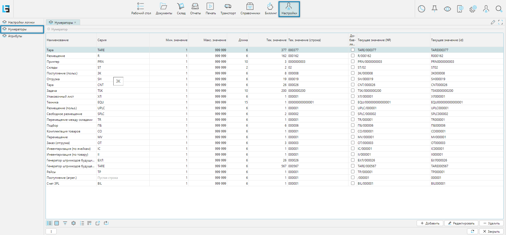
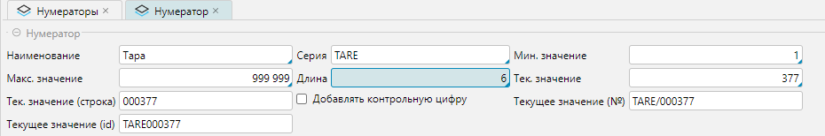

Нумераторы — это программный механизм системы, предназначенный для автоматической генерации уникальных символьных
последовательностей, используемых при маркировке, идентификации и учёте объектов. Механизм включает справочник, в 
котором создаются нумераторы и настраиваются правила формирования номеров. 

## Отображение справочника
Справочник нумераторов доступен из меню **Настройки - Нумераторы**.

 
_Рис. 1 Форма отображения справочника_

## Редактирование справочника

 
_Рис. 2 Форма редактирования нумератора_

Редактируемые значения:
- **Наименование** - наименование нумератора, отражающее область его использования
- **Серия** - часть номера. Представляет собой префикс символьной последовательности. Может включать любые символы  
  алфавитов (кириллица, латиница и др.), однако при использовании создаваемых номеров для печати штрихкодов 
  рекомендуется применять только символы латинского алфавита. 
- **Мин. значение** - минимальное значение числовой части номера, с которого начинается отсчет.
- **Макс. значение** - максимальное значение числовой части номера, на котором заканчивается формирование числовой 
  последовательности. При достижении максимального значения каждый раз будет формироваться конечное значение. 
  _Как правило, в системе используется проверка уникальности записываемых номеров, поэтому сохранить дважды номер с 
  конечным значением не получится - система выдаст сообщение об ошибке нарушение уникальности._
- **Длина** — количество символов, отводимых под числовую часть номера. Значение должно быть не меньше количества цифр,
  необходимых для представления числового значения. Полное значение числовой части номера выравнивается слева
  незначащими нулями до указанной длины. В приводимом примере (Рис. 2) 
  текущее числовое значение нумератора Тара — 377. При длине 6 символов числовая часть номера представлена как 000377. 
- **Тек. значение** - текущее значение числовой части, рассчитанное автоматически при использовании нумератора. 
- **Тек. значение (строка)** - текущее значение числовой части нумератора дополненное слева незначащими нулями до 
  значения длины.
- **Добавлять контрольную цифру** - используется для генерации номеров тар или упаковочных листов в соответствии с 
  требованиями SSCC (Serial Shipping Container Code)   
- **Текущее значение (№)** - значение номера с серией, если нумератор используется для генерации неуникальных номеров
- **Текущее значение (id)** - это значение номера с серией, если нумератор используется для генерации уникальных ID

## Привязка нумераторов

После создания нумераторы привязываются к объектам системы через пункт
меню [«Настройки логики», вкладка «Система»](options.md#вкладка-система).

