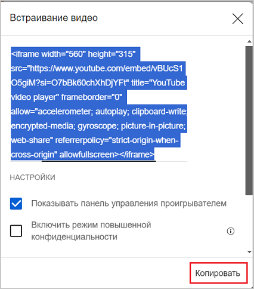

## Иконки и их названия

| Иконка                                                         | Название                  | Описание           |
|----------------------------------------------------------------|---------------------------|--------------------|
| **Grid**                                                       |                           |                    |
|            | ico_vision_data1.png      |                    |
|                | ico_table_svod.png        |                    |
|                    | ico_calendar.png          | Календарь          |
|                        | ico_filter.png            | Фильтр             |
|                    | ico_set_grid.png          | Настройка Grid     |
|          | ico_count_records.png     | Количество записей |
|                    | ico_calc_sum.png          | Посчитать сумму    |
|                | ico_export_xls.png        | Экспорт в Excel    |
|              | ico_hand_update.png       | Обновить           |
|                                                                |                           |                    |
|                  | ico_auto_fill.png         |                    |
|                | ico_scr_return.png        |                    |
|                                                                |                           |                    |
|                          | ico_karta.png             |                    |
|                    | ico_scr_full.png          |                    |
|                  | ico_pass_link.png         |                    |
|                | ico_dialog_win.png        |                    |
|                                                                |                           |                    |
|                            | ico_plus.png              |                    |
|                          | ico_minus.png             |                    |
|                          | ico_close.png             |                    |
|                                | ico_ok.png                |                    |
|                      | ico_3_point.png           |                    |
|                                                                |                           |                    |
|                              | ico_and.png               | AND                |
|                                | ico_or.png                | OR                 |
|                                                                |                           |                    |
|                        | ico_update.png            |                    |
|  | ico_button_left_right.png |                    |

## Цитаты

Цитаты начинаются со знака `>`, который начинает строку
> Это цитата

## Сообщения, предупреждения

Текст сообщений начинаются с 3-х двоеточий `:::` + идентификатор и завершаются 3-мя двоеточиями `:::`, каждый из которых на своей строке

:::note
Обычное примечание, идентификатор **note** 
:::

:::tip
Примечание типа подсказки, идентификатор **tip**
:::

:::info
Информация к размышлению, идентификатор **info**
:::

:::warning
Требует внимания, идентификатор **warning**
:::

:::danger
Ошибка, все пропало, идентификатор **danger**
:::

## Сворачивание (разворачивание) текста

Используется таг `
` для блока, внутри таг `
` для заголовка блока.
Сворачиваемый текст поддерживает разметку MarkDown 
***
**Пример:**

Алгоритм обработки отсканированного QR-кода

1. После сканирования строка содержащаяся в QR проверяется на точное совпадение со всеми штрихкодами в базе.
2. При отсутствии точных совпадений строка проверяется на соответствие каждому из активных шаблонов разрешенных пользователю в порядке, 
определенном полем шаблона **Порядок**
3. При нахождении шаблона, который позволит выделить з строки действующий штрихкод упаковки будет выполнено действие постобработки
4. В постобработку передаются два параметра: barcode, содержащий целиком отсканированную строку и pack, содержащий ссылку на упаковку
Код постобработки при выполнении действия вставляется в модуль с уникальным именем. Заголовок этого модуля формируется системой, 
он объявляет уникальное имя модуля и в инструкции REQUIRE перечисляет все модули, которые есть в проекте. Таким образом, 
из кода можно использовать все элементы системы из других модулей.

## Вставка видео из YouTube

    
1. Под видео нажимаем кнопку "Поделиться"

  
2. Выбираем "Встроить"

  
3. Нажимаем кнопку "Копировать" и затем вставляем, как есть скопированный html текст

<iframe width="560" height="315" src="https://www.youtube.com/embed/vBUcS1O5giM?si=O7bBk60chXhDjYFt" title="YouTube video player" frameborder="0" allow="accelerometer; autoplay; clipboard-write; encrypted-media; gyroscope; picture-in-picture; web-share" referrerpolicy="strict-origin-when-cross-origin" allowfullscreen></iframe>

