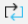
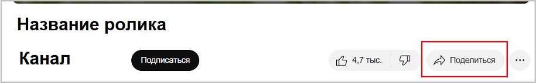
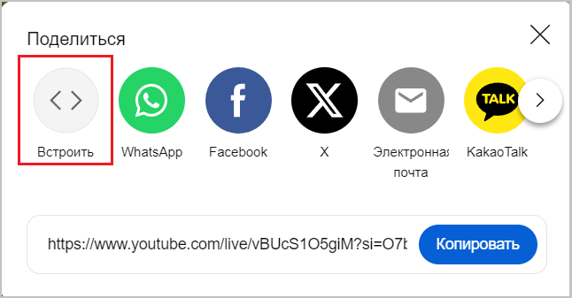

## Иконки и их названия

| Иконка                                                         | Название                  | Описание           |
|----------------------------------------------------------------|---------------------------|--------------------|
| **Grid**                                                       |                           |                    |
|            | ico_vision_data1.png      |                    |
|                | ico_table_svod.png        |                    |
|                    | ico_calendar.png          | Календарь          |
|                        | ico_filter.png            | Фильтр             |
|                    | ico_set_grid.png          | Настройка Grid     |
|          | ico_count_records.png     | Количество записей |
|                    | ico_calc_sum.png          | Посчитать сумму    |
|                | ico_export_xls.png        | Экспорт в Excel    |
|              | ico_hand_update.png       | Обновить           |
|                                                                |                           |                    |
|                  | ico_auto_fill.png         |                    |
|                | ico_scr_return.png        |                    |
|                                                                |                           |                    |
|                          | ico_karta.png             |                    |
|                    | ico_scr_full.png          |                    |
|                  | ico_pass_link.png         |                    |
|                | ico_dialog_win.png        |                    |
|                                                                |                           |                    |
|                            | ico_plus.png              |                    |
|                          | ico_minus.png             |                    |
|                          | ico_close.png             |                    |
|                                | ico_ok.png                |                    |
|                      | ico_3_point.png           |                    |
|                                                                |                           |                    |
|                              | ico_and.png               | AND                |
|                                | ico_or.png                | OR                 |
|                                                                |                           |                    |
|                        | ico_update.png            |                    |
|  | ico_button_left_right.png |                    |

## Цитаты

Цитаты начинаются со знака `>`, который начинает строку
> Это цитата

**Пример**, цитата внутри сообщения:
[Оборудование, Пример кода для стандартного шаблона (см. _внизу_)](../admin/logics/equipment.md#весоизмерительное-оборудование)

## Сообщения, предупреждения

Текст сообщений начинаются с 3-х двоеточий `:::` + идентификатор и завершаются 3-мя двоеточиями `:::`, каждый из которых на своей строке

:::note
Обычное примечание, идентификатор **note** 
:::

:::tip
Примечание типа подсказки, идентификатор **tip**
:::

:::info
Информация к размышлению, идентификатор **info**
:::

:::warning
Требует внимания, идентификатор **warning**
:::

:::danger
Ошибка, все пропало, идентификатор **danger**
:::

## Раздельные линии

Разделительная линия задается, как три или более подряд идущих символов `***`  
***
Эта строка отделена от предыдущей разделительной линией  
**Примеры:**
[Оборудование, Пример кода для стандартного шаблона (см. _внизу_)](../admin/logics/equipment.md#весоизмерительное-оборудование)

## Сворачивание (разворачивание) текста

Используется таг `
` для блока, внутри таг `
` для заголовка блока.
Сворачиваемый текст поддерживает разметку MarkDown 

**Заголовок сворачиваемого текста**

Чтобы сработал заголовок для сворачиваемого текста обязательно сам **текст** должен быть отделен пробельной строкой от заголовка или 
следующий за заголовком текст это список.  
Начертим линию и после нее добавим сообщение 
***
:::note Внимание
Это **добавленное** сообщение
:::

**Примеры:**
[Оборудование, Алгоритм обработки](../admin/logics/equipment.md#весоизмерительное-оборудование)

## Вставка видео из YouTube

1. Находим нужный ролик
2. Внизу нажимаем кнопку **Поделиться**
3. В появившемся окне выбираем **Встроить** 

    

4\. В новом окне нажимаем кнопку **Копировать** и текст отмеченный красной стрелкой будет скопирован в буфер обмена.
Текст из буфера обмена вставляем **как есть** в md файл

<iframe width="560" height="315" src="https://www.youtube.com/embed/8owG83ozHYw?si=9CuD8fhiLtLjiotn" title="YouTube video player" frameborder="0" allow="accelerometer; autoplay; clipboard-write; encrypted-media; gyroscope; picture-in-picture; web-share" referrerpolicy="strict-origin-when-cross-origin" allowfullscreen></iframe>

## Ошибки при build

При выполнении команды **yarn build** иногда можно получить сообщение:

> Cannot infer the update date for some files, as they are not tracked by git
> Не удается определить дату обновления для некоторых файлов, так как они не отслеживаются git. 

Это ситуация, как правило, возникает для графических файлов. 
Вообще какие файлы не попали в git можно по команде **git status**. Просмотрев выданную информацию необходимо в дереве проекта Idea 
вручную добавить каталоги или файлы, для чего выполнить действия:
- Стать на файл и каталог в дереве проекта
- Нажать правую кнопку мыши и из меню выбрать **Git - + Add (Ctrl+Alt+A)**

