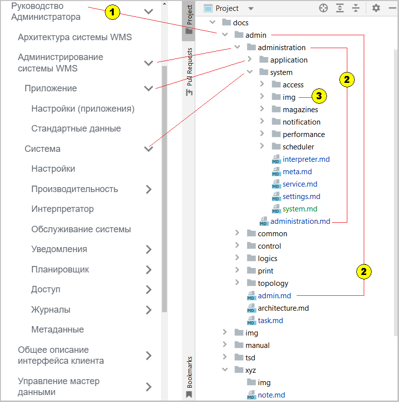
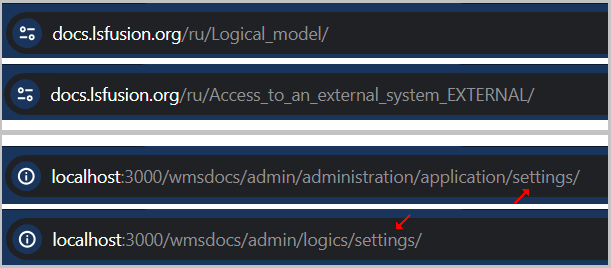
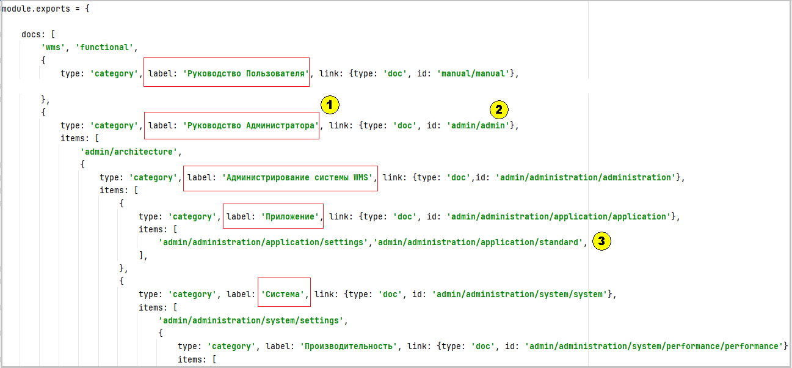
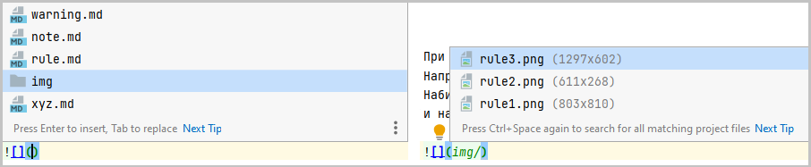

## Общие
Исключаются из администрирования разделы:
- Установка системы WMS
- Интеграция
- Миграция

Так как не предполагается многоязычие, то все файлы располагаются в папке Docs 

## Общая структура документа
Структура документа представляет собой древовидную иерархию, которая прослеживается как:

- в рабочей версии документа
- в структуре проекта:

1. Наименования в справочном руководстве соответствуют своим каталогам-идентификаторам в проекте
2. Каждой папке в проекте **всегда** соответствует свой md файл с аналогичным названием
3. Каждая папка при необходимости имеет свою личную папку **img** - каталог графической информации  

  
Рис. 1 Структура проекта

Структура проекта, соответствующая более или менее один-в-один, рабочему документу, выбрана с целью:

- Переносимостью в другие проекты. Любой уровень может быть просто перекопирован в другой проект со своими папками.
  Ничего не надо "выгрызать" и искать. Например: необходимо поддержать раздел администрирования в другом проекте. 
Просто скопировали все из папки admin и добавили в исправляемый sidebars.js фрагмент текущего sidebars.js. 
- Упрощения навигации для поиска и исправлений, где каждому разделу соответствует небольшое количество md документов и картинок, 
что позволяет эффективно вносить правки или выполнять рефакторинг при необходимости.
- Не надо придумывать сложные имена md файлов. Имена md файлов могут быть простыми и одинаковыми для разных каталогов. То же справедливо и для графических файлов. 

  
Рис 2. Сложные и Простые идентификаторы

Для примера на рисунке приводятся сложные идентификаторы, используемые для md файлов платформы. Все md файлы располагаются в одном каталоге, 
поэтому должна соблюдаться уникальность имен. 

В текущем проекте WMS md файлы разложены по своим папкам, поэтому идентификаторы могут быть простыми и совпадать в разных папках. 
Соответственно, не надо себя "грузить" сложно составным набором английских слов.   

## Заполнение sidebars.js

Так как проект разбит на каталоги, то для создания порядка отображения данных для md файлов прописываются полные имена (относительно папки Docs).

Рис. 3. Заполнение sidebars.js 

1. Название узла дерева (рис. 3 (1))
2. Файл md совпадающий по названию папки узла дерева (рис. 3 (2))
3. Файлы md входящие в свой каталог (рис. 3 (3))

## Имена графических файлов

Здесь без "чудес" - имя графического файла совпадает с именем файла, к которому он относиться с добавлением порядкового номера. 
Например: для файла settings.md имеем в каталоге img 3 графических файла: settings1.png, settings2.png, settings3.png. 
Файлы нумеруются по номерам рисунков (_желательно_). 

Если надо вставить промежуточный графический файл, то можно добавить букву в конце после цифры. 
Например: надо вставить еще один рисунок, не оформляемый как рисунок 2, между рисунком 1 и 2, то его имя будет settings1a.png 

Обращение к рисункам всегда идет в формате относительного пути: ``. 

Некоторые часто используемые иконки вынесены в отдельный [каталог](note.md) `docs / img`. 

Обращение к ним как по пути следования, принятого для работы с файловой системой, 

например: . Оригинальная запись: ``. 

## Вызов подсказки при вводе

При выборе ссылок или картинок можно использовать подсказки при вводе по CTRL+Пробел.
Например, нужно выбрать графический файл с именем rule3.png
Набираем сразу ``, затем переносим курсор внутрь круглых скобок и нажимаем CTRL+Пробел, 
и на кране появиться выпадающее меню из которого мышкой вначале выбираем img, а потом и искомый файл.

  
Рис. 4 Подсказки при вводе

Таком образом, можно обойтись без ручного набора наименований. 

## Выделение текста, ссылки

Чтобы не было "елки" предлагаю текст выделять только жирным начертанием. Не использовать курсив и жирный курсив. 

Наименования рисунков писать прямым текстом без выделений, например: Рис. 1. Эта картинка

Ссылки на элемент рисунка обозначать со всеми открытыми и закрытыми скобками, например так: 
- (рис. 1(1)) - правильно
- (рис. 1(1) - неправильно. Неправильность "режет" глаз, так как нарушается правило: количество открывающихся и закрывающихся скобок должно совпадать. 

## Общее по написанию текста

Текст размещается в видимой области изображение на экране.
При этом если текст большой, то он переносится по знакам препинания или пробелу на новую строку, так чтобы содержание укладывалось в видимой части экрана.
Писать все в одну строку плохо для будущих правок. Текст воспринимается плохо. Возможно, написанное здесь больше касается переноса из Confluence, когда 
копируемый абзац вытягивается в одну строку.

Два пробела в конце и написание через строчку это не одно и тоже:

Строка 1 у которой два пробела в конце этой строки  
Строка 2, следующая за ней с новой строки

Строка 3, следующая через строчку. Первые 2-ве строки имею минимальный зазор между собой 

  
## Сообщения по тексту

Сообщения по тексту делаются, см. [варианты:](note.md#сообщения-предупреждения)

Пример использования: [Справочник сотрудников, вкладка роли](../admin/control/employee.md#вкладка-роли)  

## Заголовки внутри

Для заголовков внутри выбирается уровень 2: `##`
Расстояние между заголовками на третьей строке от текста последнего заголовка

## Таблицы

Для рисования таблиц можно [воспользоваться](https://www.tablesgenerator.com/markdown_tables#) он-лайн генератором.

## Переименования, перемещения и удаления файлов

Все переименования, перемещения или удаления файлов (рефакторинг) выполняются по правой кнопке мыши на изменяемом элементе, 
через пункт меню **Refactor** или **Delete**. Это касается папок, имен файлов md или png. 
Редактор IntelliJ IDEA все сделает правильно с изменяемым элементом. 

